# Chapter 1 - Example 1
## Overview and outcomes
This example provides a walktrough to build the binary of our "Hello World" Golang flavor, run it using Podman Dekstop, then deploy the same application on Kubernetes. 

The goals are to:

* Refresh knowledge about building a container image.
* Perform the build and run on your local environment.
* Deploy on Kubernetes and discover the differences with Podman (or Docker).

## Get your environment ready
First clone the git repository:  
```
git clone https://github.com/PacktPublishing/Kubernetes-Secret-Management-Handbook.git 
```

Verify that the folder is available with your environment:  
```
ls -al
total 16
drwxr-xr-x   4 romdalf  staff   128 May  6 15:55 .
drwxr-xr-x  12 romdalf  staff   384 May  6 15:55 ..
drwxr-xr-x@  7 romdalf  staff   224 May  4 12:16 Kubernetes-Secret-Management-Handbook
```

Go in the folder and the relevant chapter and example:  
```
cd Kubernetes-Secret-Management-Handbook/ch01/example01/
```

Have a look at the content:  
``` 
ls -al
```
```
total 64
drwxr-xr-x@  8 romdalf  staff    256 May  7 19:44 .
drwxr-xr-x@  3 romdalf  staff     96 May  4 12:08 ..
-rw-r--r--@  1 romdalf  staff    582 May  4 12:33 Dockerfile
drwxr-xr-x@  3 romdalf  staff     96 May  4 12:33 hello
drwxr-xr-x  12 romdalf  staff    384 May  6 19:31 images
-rw-r--r--@  1 romdalf  staff    562 May  7 22:30 k8s-hello_world-ingress.yaml
-rw-r--r--   1 romdalf  staff    501 May  7 19:44 k8s-hello_world.yaml
-rw-r--r--   1 romdalf  staff  12335 May  7 19:44 readme.md
```

There are 5 items:    

* Dockerfile; a build manifest to instruct Podman the steps to compil the Golang code into a binary and build the container image.
* hello; a folder containing the ```main.go``` file containing the code of our "Hello World".
* images; all the screenshot for this how-to file.
* k8s-hello_world-ingress.yaml; the Kubernetes Service file to access the "Hello World" application for the outside world. 
* k8s-hello_world.yaml; the Kubernetes Pod deployment file for our "Hello World" application.
* readme.md; this how-to file.

## Build
### The Golang code
The "Hello World" code perform the followings:

* Start a webserver on port 8080.
* Print in the browser the message "Hello from path: *URL path*".
* Print at the console the message "User request the URL path: *URL path*".

```Go
package main

import (
    "fmt"
    "log"
    "net/http"
)

func main() {

        // print the hello message with the URL path 
        http.HandleFunc("/", func(w http.ResponseWriter, r *http.Request) {
        fmt.Fprintf(w, "Hello from URL path: %s\n", r.URL.Path)

                // if URL path is root - propose a test
                if r.URL.Path == "/" {
                        fmt.Fprintf(w, "Try to add /packt as a path.")
                }

                // print the URL path at the console
                if r.URL.Path != "/favicon.ico" {
                        fmt.Printf("User requested the URL path: %s\n", r.URL.Path)
                }
    })

        // print message at the console
        fmt.Println("Kubernetes Secret Management Handbook - Chapter 1 - Example 1 - Hello World")
        fmt.Println("--> Server running on http://localhost:8080")

        // start the service and listen on the given port
    if err := http.ListenAndServe(":8080", nil); err != nil {
                // print error messages at the console
                log.Fatal(err)
        }
}
```

### The Dockerfile
The Dockerfile perform the followings:

* Fetch the Red Hat Universal Base Image with the Golang Toolset as a build image only.
* Copy the "Hello World" code and build a binary.
* Fetch the micro Red Hat Universal Base Image and copy the binary in it.
* Reference a port exposure, here port 8080.
* Reference the binary as an entrypoint.

```Docker
FROM registry.access.redhat.com/ubi8/go-toolset@sha256:168ac23af41e6c5a6fc75490ea2ff9ffde59702c6ee15d8c005b3e3a3634fcc2 AS build

COPY ./hello/* .
RUN go mod init hello 
RUN go mod tidy
RUN go build .

FROM registry.access.redhat.com/ubi8/ubi-micro@sha256:6a56010de933f172b195a1a575855d37b70a4968be8edb35157f6ca193969ad2
LABEL org.opencontainers.image.title "Hello from Path"
LABEL org.opencontainers.inage.description "Kubernetes Secret Management Handbook - Chapter 01 - Containter Build Example"

COPY --from=build ./opt/app-root/src/hello .

EXPOSE 8080
ENTRYPOINT ["./hello"]
```

### Build the "Hello World" image from the Podman Desktop 

Within Podman Desktop, click on the *Cloud* icon leading to the container images:
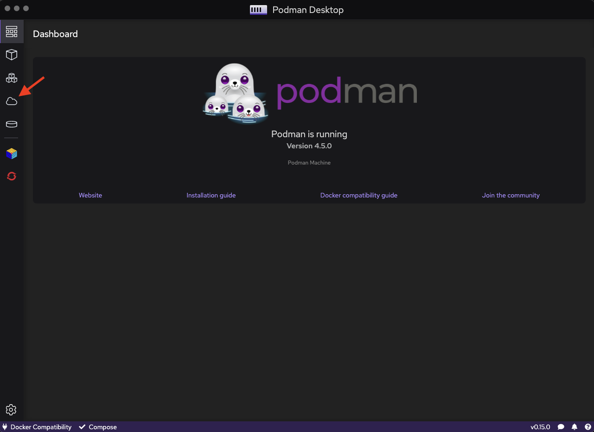

Then, click the *Build an image* button in the top right corner:
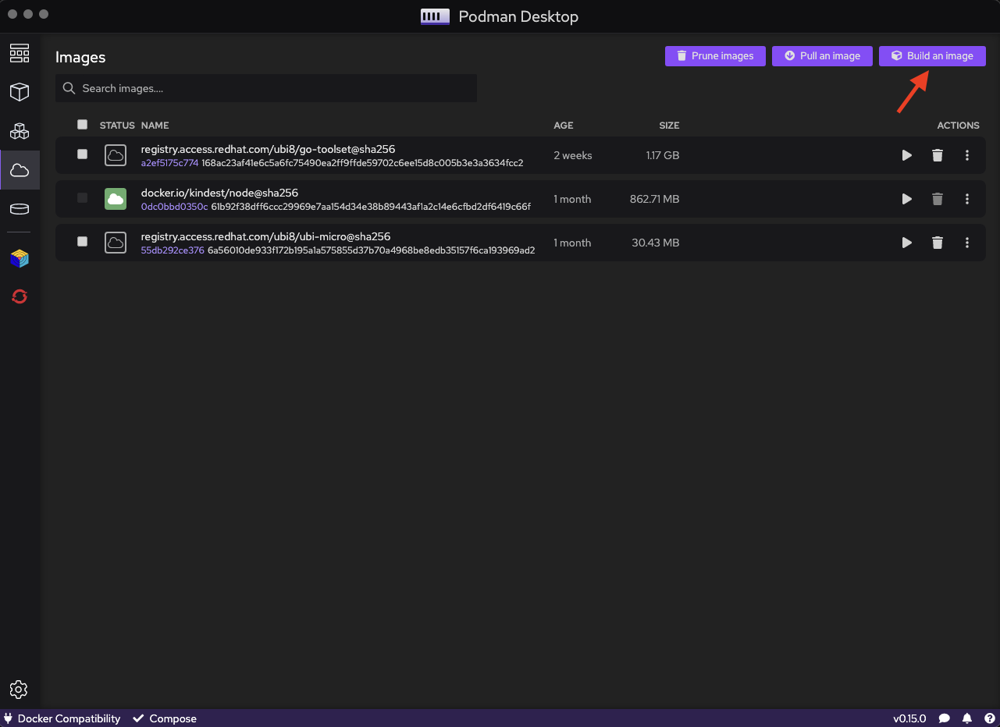

Fill in the form and provide a tag using the ```localhost/``` prefix then click the *Build* button: 
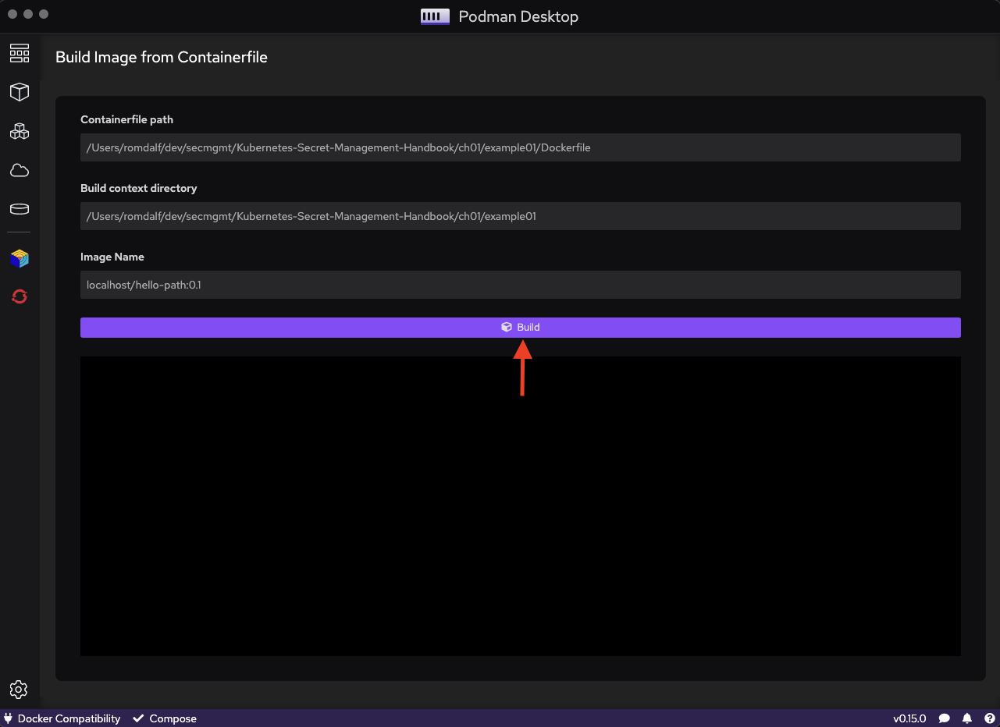

Review the logs and click *Done*: 
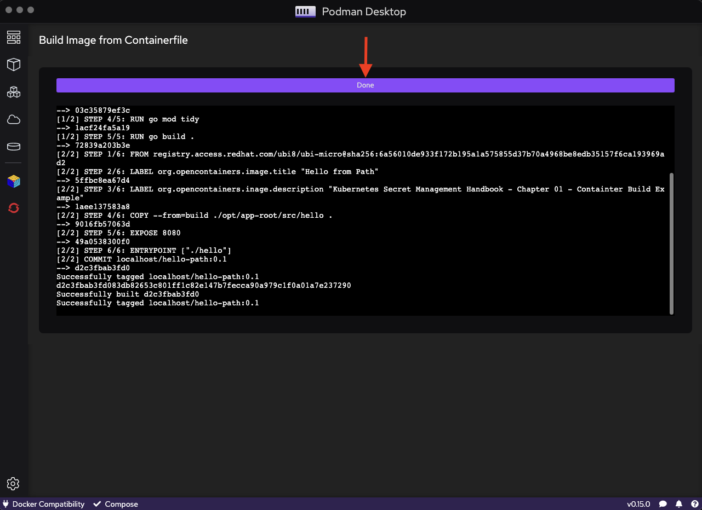

Back to the container image lists, the newly container image we built is now available. Click on it:
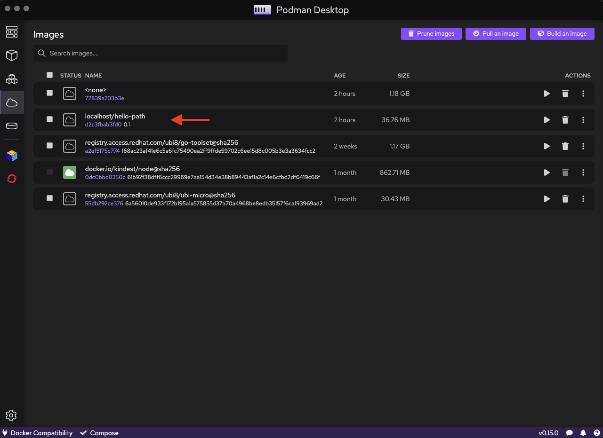

Browse the details of the "Hello World" container image:
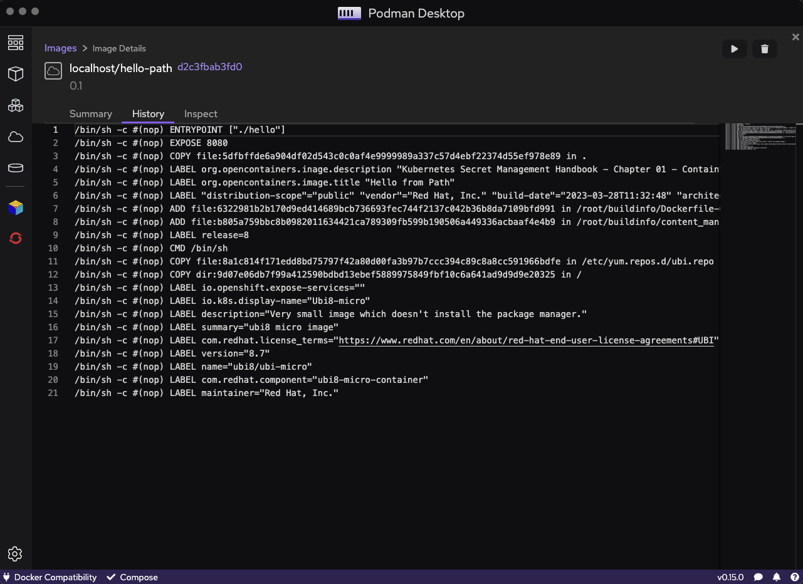

### Build the "Hello World" image from the CLI 
From the path ```Kubernetes-Secret-Management-Handbook/ch01/example01/```, run the following command:

```bash 
podman build . --tag hello-path:0.1
```

This will instruct Podman to look for a Dockerfile within the current directory and build the containter image with *hello-path:0.1* as the name and version or the so-called tag.

The output should be similar to:

```console
[1/2] STEP 1/5: FROM registry.access.redhat.com/ubi8/go-toolset@sha256:168ac23af41e6c5a6fc75490ea2ff9ffde59702c6ee15d8c005b3e3a3634fcc2 AS build
[1/2] STEP 2/5: COPY ./hello/* .
--> 934c2e8c3831
[1/2] STEP 3/5: RUN go mod init hello 
go: creating new go.mod: module hello
go: to add module requirements and sums:
        go mod tidy
--> 140584340d42
[1/2] STEP 4/5: RUN go mod tidy
--> 8276c33a5da9
[1/2] STEP 5/5: RUN go build .
--> 88a1f5da22d4
[2/2] STEP 1/6: FROM registry.access.redhat.com/ubi8/ubi-micro@sha256:6a56010de933f172b195a1a575855d37b70a4968be8edb35157f6ca193969ad2
[2/2] STEP 2/6: LABEL org.opencontainers.image.title "Hello from Path"
--> 9d3ccc166e60
[2/2] STEP 3/6: LABEL org.opencontainers.inage.description "Kubernetes Secret Management Handbook - Chapter 01 - Containter Build Example"
--> 8441f37e701c
[2/2] STEP 4/6: COPY --from=build ./opt/app-root/src/hello .
--> f01d2c53e467
[2/2] STEP 5/6: EXPOSE 8080
--> 5aec7a2bf7ec
[2/2] STEP 6/6: ENTRYPOINT ["./hello"]
[2/2] COMMIT hello-path:0.1
--> ab5c96d0ab85
Successfully tagged localhost/hello-path:0.1
ab5c96d0ab858d3fe735bb7e1586197001d8da36abd8d76df8b1f2a6f263071b
```

Finally, use the following command to verify the image status:

```bash
podman images
REPOSITORY                                  TAG         IMAGE ID      CREATED         SIZE
localhost/hello-path                        0.1         ab5c96d0ab85  13 seconds ago  36.8 MB
<none>                                      <none>      88a1f5da22d4  14 seconds ago  1.18 GB
registry.access.redhat.com/ubi8/go-toolset  <none>      a2ef5175c774  12 days ago     1.17 GB
registry.access.redhat.com/ubi8/ubi-micro   <none>      55db292ce376  5 weeks ago     30.4 MB
```

## Run

### Run "Hello World" using Podman Desktop

To run our freshly built container "Hello World" from Podman Desktop, click on the *Play* icon:
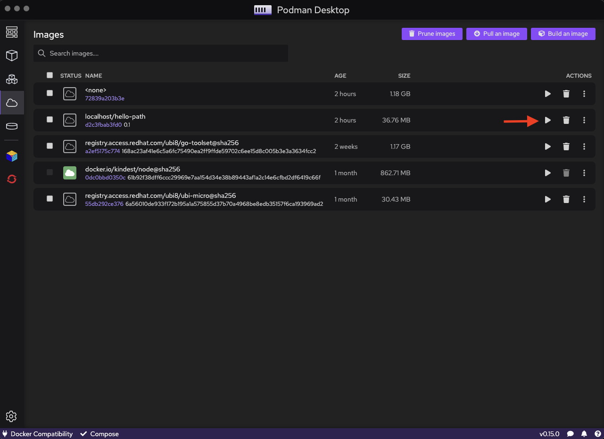

Then, at the current stage, don't change anything parameters and click the *Start Container* button:
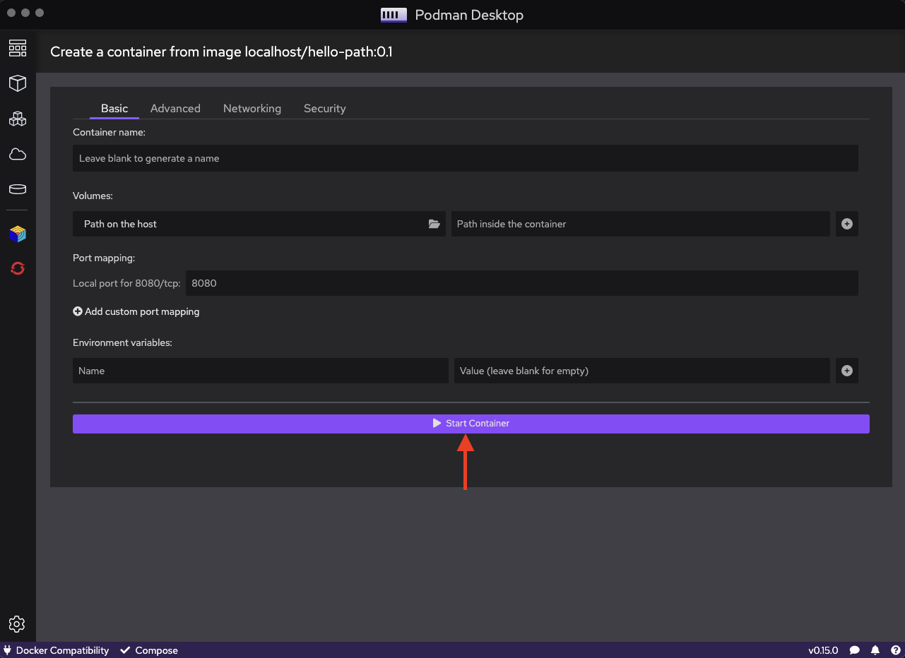

This will open the *Containers* view and show our image running with a random name. 
This is due to the fact that we did not give. Click on the container entry:
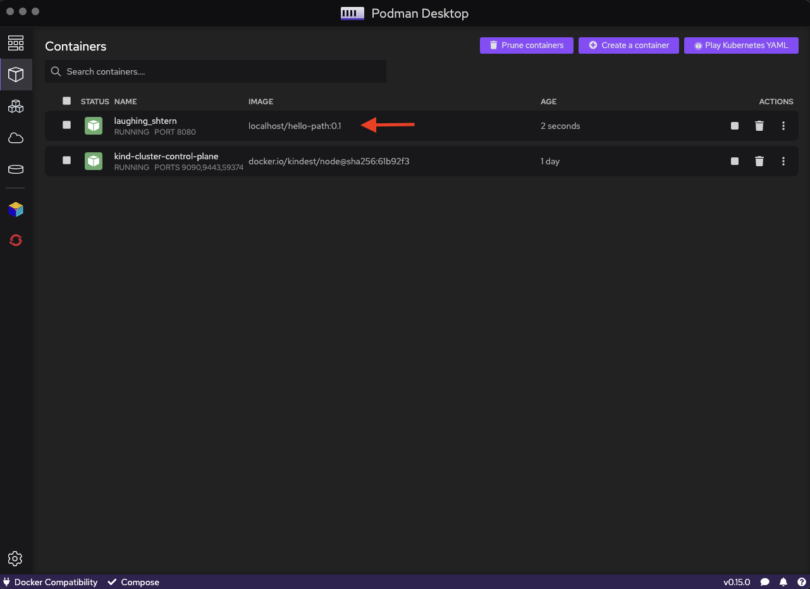

The *Logs* tab will open a console showing our container logs. Open an Internet Browser and type type in the URL shown in the logs ```https://localhost:8080```. This should shows a message in the browser as well as in the container logs. Change the URL path with ```/packt``` or anything else and observe the behavior.  
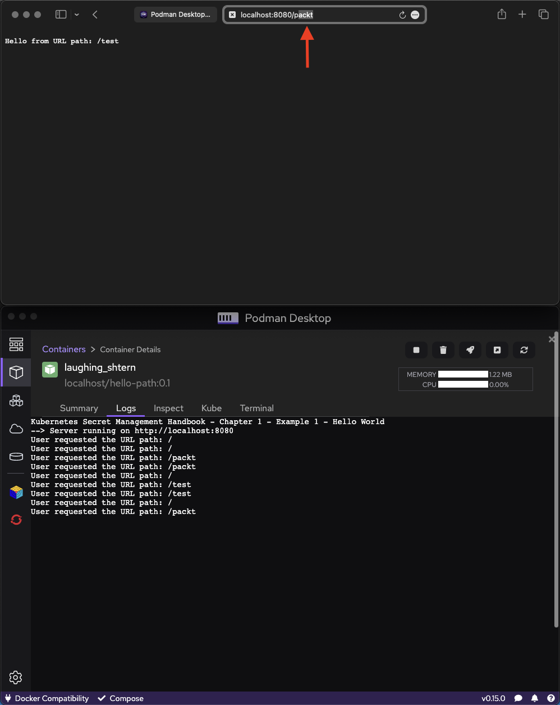

### Run "Hello World using Kubernetes from Podman Desktop

Let's stop the "Hello World" container running with Podman. 

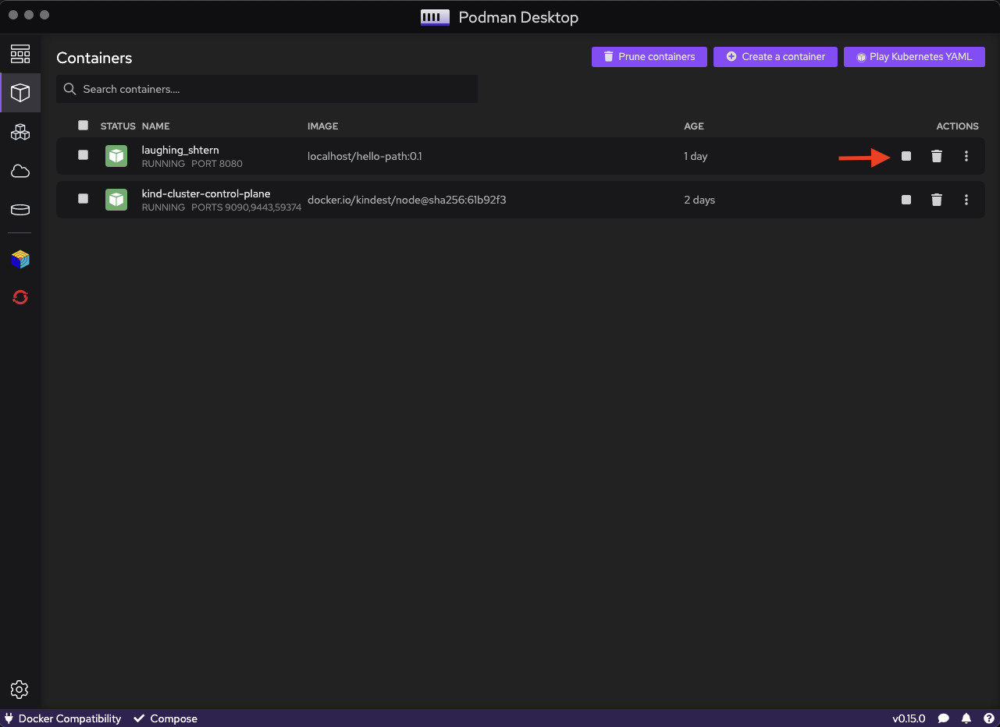

Then, we need to push our "Hello World" image from our local (read localhost) repository to the Kubernetes one. 

Let's check what are the current images available within our Kind Kubernetes cluster:
```
podman exec -ti kind-cluster-control-plane crictl images 
```

A similar output should be shown and we can confirm that our ```localhost/hello-path``` image is not present:
```
IMAGE                                                     TAG                 IMAGE ID            SIZE
docker.io/envoyproxy/envoy                                v1.25.2             8663724adc98f       51.7MB
docker.io/kindest/kindnetd:v20230330-48f316cd             <none>              43ef1c5209cd9       25.3MB
docker.io/kindest/local-path-helper:v20230330-48f316cd    <none>              e5f9a0a1ed364       2.92MB
docker.io/kindest/local-path-provisioner:v0.0.23-kind.0   <none>              9eda906092e57       16.6MB
ghcr.io/projectcontour/contour                            v1.24.2             a8894204792ae       13.4MB
registry.k8s.io/coredns/coredns                           v1.9.3              b19406328e70d       13.4MB
registry.k8s.io/etcd                                      3.5.6-0             ef24580282403       80.5MB
registry.k8s.io/kube-apiserver                            v1.26.3             92e90fc362928       78MB
registry.k8s.io/kube-controller-manager                   v1.26.3             96fd77e7825a4       66.7MB
registry.k8s.io/kube-proxy                                v1.26.3             53df69d2174ba       63.4MB
registry.k8s.io/kube-scheduler                            v1.26.3             9c689f0fff925       56.3MB
registry.k8s.io/pause                                     3.7                 e5a475a038057       268kB
```

To push the image, we will be using the Kind command line as follow:
```
kind load docker-image hello-path:0.1 -n kind-cluster
```

A similar output should be shown:
```
Image: "hello-path:0.1" with ID "sha256:d2c3fbab3fd083db82653c801ff1c82e147b7fecca90a979c1f0a01a7e237290" not yet present on node "kind-cluster-control-plane", loading...
``` 

At this stage, we can run again the command to verify the list of available images:
```
podman exec -ti kind-cluster-control-plane crictl images 
```

A similar output should be shown with our ```localhost/hello-path``` image now present:
```
IMAGE                                                     TAG                 IMAGE ID            SIZE
docker.io/envoyproxy/envoy                                v1.25.2             8663724adc98f       51.7MB
docker.io/kindest/kindnetd:v20230330-48f316cd             <none>              43ef1c5209cd9       25.3MB
registry.k8s.io/coredns/coredns                           v1.9.3              b19406328e70d       13.4MB
docker.io/kindest/local-path-helper:v20230330-48f316cd    <none>              e5f9a0a1ed364       2.92MB
docker.io/kindest/local-path-provisioner:v0.0.23-kind.0   <none>              9eda906092e57       16.6MB
ghcr.io/projectcontour/contour                            v1.24.2             a8894204792ae       13.4MB
localhost/hello-path                                      0.1                 d2c3fbab3fd08       36.8MB
registry.k8s.io/etcd                                      3.5.6-0             ef24580282403       80.5MB
registry.k8s.io/kube-apiserver                            v1.26.3             92e90fc362928       78MB
registry.k8s.io/kube-controller-manager                   v1.26.3             96fd77e7825a4       66.7MB
registry.k8s.io/kube-proxy                                v1.26.3             53df69d2174ba       63.4MB
registry.k8s.io/kube-scheduler                            v1.26.3             9c689f0fff925       56.3MB
registry.k8s.io/pause                                     3.7                 e5a475a038057       268kB
```

Let's go back into Podman Desktop and generate the deployment manifest. To do let's click on the "More" icon and select "Generate Kube":
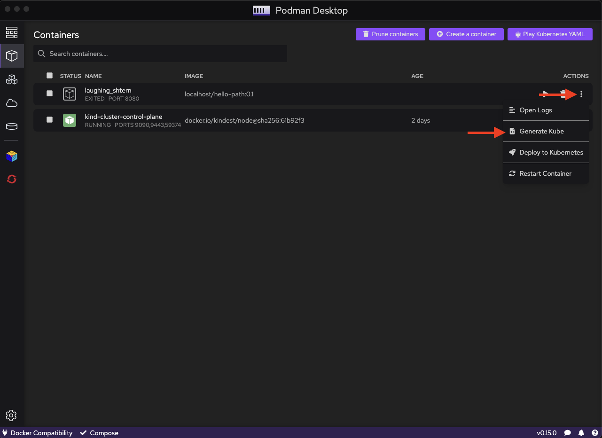

This will open the following window with the deployment manifest for our "Hello World" container. As you can see, the major difference with running a container with Podman (or Docker) is that you have to provide a Pod object definition that will be sent to the ```kube-apiserver``` to process.  

Let's have a copy/past of this output into a file that you will name ```k8s-hello_world.yaml```. The content should be similar to:

```YAML
# Save the output of this file and use kubectl create -f to import
# it into Kubernetes.
#
# Created with podman-4.5.0
apiVersion: v1
kind: Pod
metadata:
  annotations:
    io.podman.annotations.ulimit: nofile=524288:524288,nproc=7252:7252
  creationTimestamp: "2023-05-07T17:36:20Z"
  labels:
    app: laughingshtern-pod
  name: laughingshtern-pod
spec:
  containers:
  - image: localhost/hello-path:0.1
    name: laughingshtern
    ports:
    - containerPort: 8080
      hostPort: 8080
    tty: true
```

Now, you can click on the "Deploy to Kubernetes" icon:
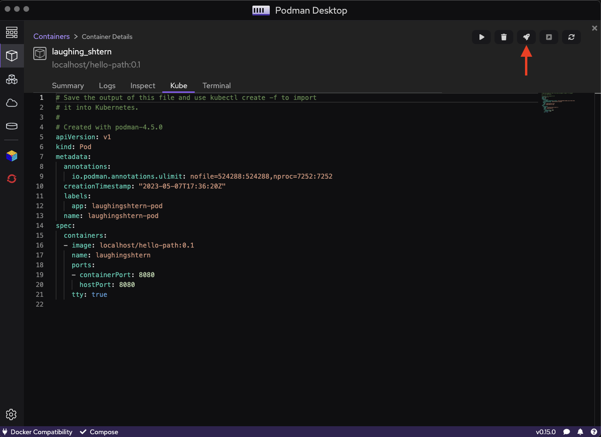

This will open the following window where you will have to tick the box "Create an Ingress..." and then click the "Deploy" button:
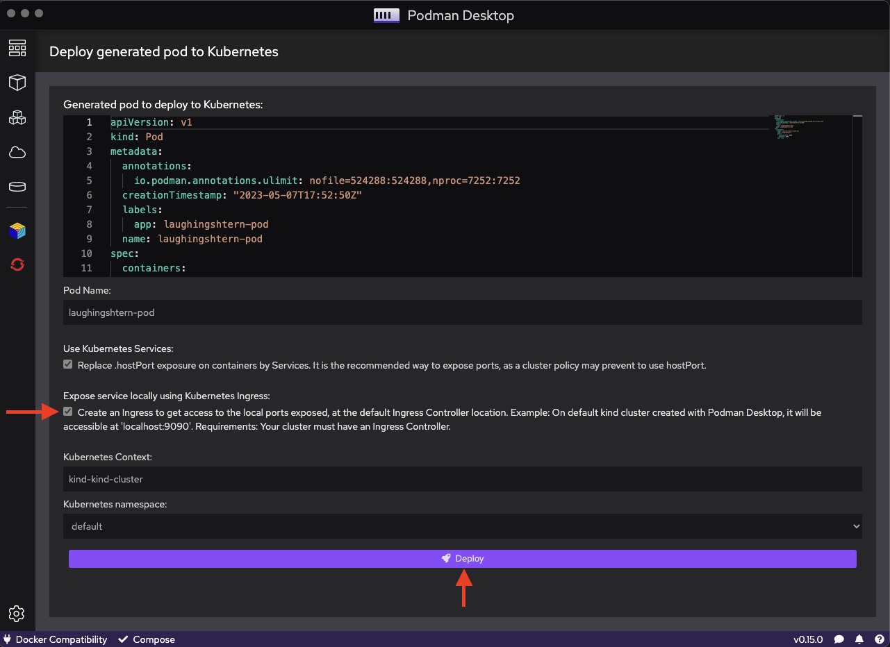

This will update the window with the status, note the ingress URL to access the "Hello World" is ***localhost:9090*** (it might be different with your setup), and you can click the "Done" button:
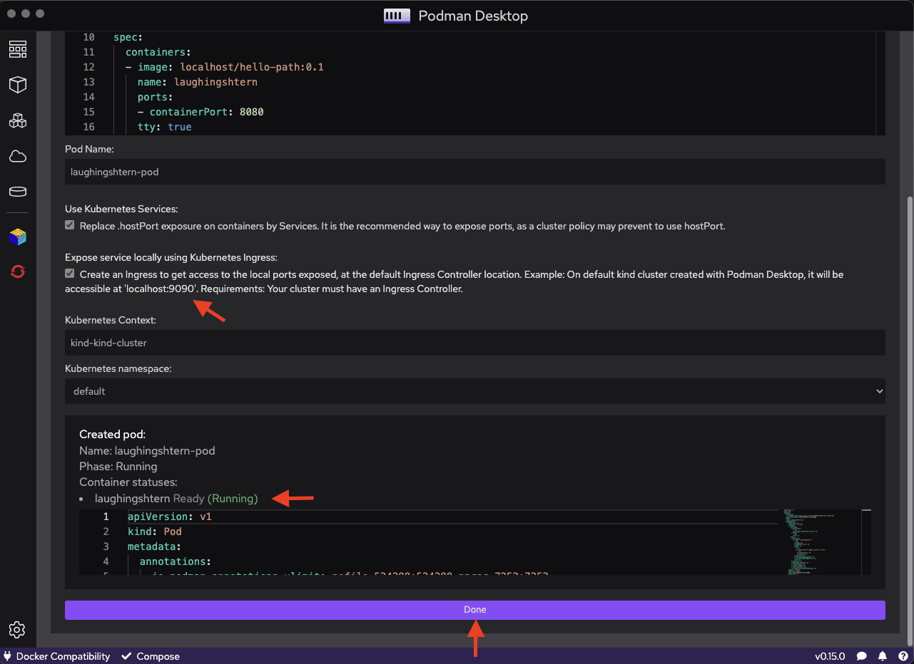

Back to the main window, let's go in the Pod section and click on our newly created deployment:
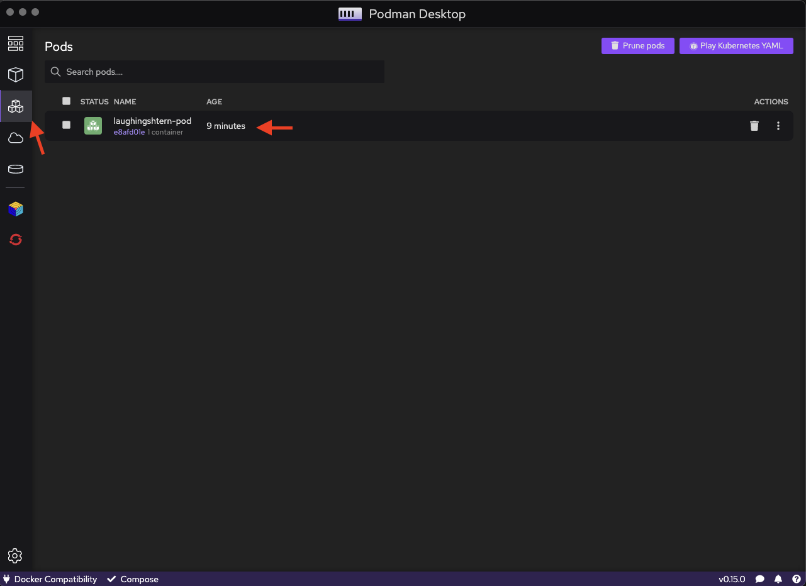

Let's open an Internet Browser with the URL ***http://localhost:9090*** (it might be different with your setup) and update the URL a couple of time with ***http://localhost:9090/test*** or ***http://localhost:9090/packt***:  
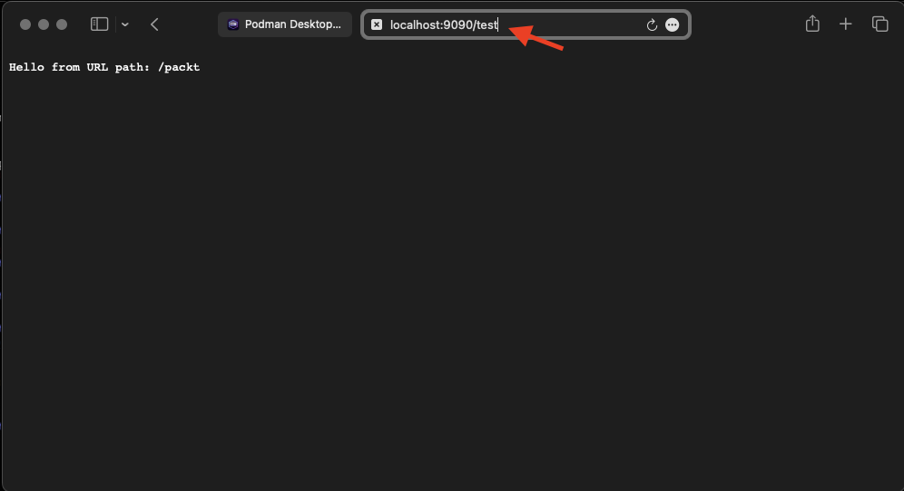

Let's get into the "Logs" tab and check the Podman Desktop Pod Logs window to verify that we have the logs being generated:


### Run "Hello World using Kubernetes from the CLI
Now that we have succeeded to deploy our application using the Podman Desktop, let's do it via the CLI. 

First, let's gather the entire object list of our Kubernetes cluster:
```
kubectl get all -A |grep laughing
```
```
NAMESPACE            NAME                                                     READY   STATUS      RESTARTS   AGE
default              pod/laughingshtern-pod                                   1/1     Running     0          137m
kube-system          pod/coredns-787d4945fb-qhd5q                             1/1     Running     0          2d4h
kube-system          pod/coredns-787d4945fb-qnzcs                             1/1     Running     0          2d4h
kube-system          pod/etcd-kind-cluster-control-plane                      1/1     Running     0          2d4h
kube-system          pod/kindnet-96hng                                        1/1     Running     0          2d4h
kube-system          pod/kube-apiserver-kind-cluster-control-plane            1/1     Running     0          2d4h
kube-system          pod/kube-controller-manager-kind-cluster-control-plane   1/1     Running     0          2d4h
kube-system          pod/kube-proxy-85jvn                                     1/1     Running     0          2d4h
kube-system          pod/kube-scheduler-kind-cluster-control-plane            1/1     Running     0          2d4h
local-path-storage   pod/local-path-provisioner-75f5b54ffd-w4bkg              1/1     Running     0          2d4h
projectcontour       pod/contour-74866bdd99-98t46                             1/1     Running     0          2d4h
projectcontour       pod/contour-74866bdd99-l5wkf                             1/1     Running     0          2d4h
projectcontour       pod/contour-certgen-v1.24.2-m5hxw                        0/1     Completed   0          2d4h
projectcontour       pod/envoy-6wmd2                                          2/2     Running     0          2d4h

NAMESPACE        NAME                              TYPE           CLUSTER-IP      EXTERNAL-IP   PORT(S)                      AGE
default          service/kubernetes                ClusterIP      10.96.0.1       <none>        443/TCP                      2d4h
default          service/laughingshtern-pod-8080   ClusterIP      10.96.135.26    <none>        8080/TCP                     137m
kube-system      service/kube-dns                  ClusterIP      10.96.0.10      <none>        53/UDP,53/TCP,9153/TCP       2d4h
projectcontour   service/contour                   ClusterIP      10.96.148.178   <none>        8001/TCP                     2d4h
projectcontour   service/envoy                     LoadBalancer   10.96.72.220    <pending>     80:32009/TCP,443:31802/TCP   2d4h

NAMESPACE        NAME                        DESIRED   CURRENT   READY   UP-TO-DATE   AVAILABLE   NODE SELECTOR            AGE
kube-system      daemonset.apps/kindnet      1         1         1       1            1           kubernetes.io/os=linux   2d4h
kube-system      daemonset.apps/kube-proxy   1         1         1       1            1           kubernetes.io/os=linux   2d4h
projectcontour   daemonset.apps/envoy        1         1         1       1            1           <none>                   2d4h

NAMESPACE            NAME                                     READY   UP-TO-DATE   AVAILABLE   AGE
kube-system          deployment.apps/coredns                  2/2     2            2           2d4h
local-path-storage   deployment.apps/local-path-provisioner   1/1     1            1           2d4h
projectcontour       deployment.apps/contour                  2/2     2            2           2d4h

NAMESPACE            NAME                                                DESIRED   CURRENT   READY   AGE
kube-system          replicaset.apps/coredns-787d4945fb                  2         2         2       2d4h
local-path-storage   replicaset.apps/local-path-provisioner-75f5b54ffd   1         1         1       2d4h
projectcontour       replicaset.apps/contour-74866bdd99                  2         2         2       2d4h

NAMESPACE        NAME                                COMPLETIONS   DURATION   AGE
projectcontour   job.batch/contour-certgen-v1.24.2   1/1           16s        2d4h
```

What we are insterested in are the following objects:
```
NAMESPACE            NAME                                                     READY   STATUS      RESTARTS   AGE
default              pod/laughingshtern-pod                                   1/1     Running     0          137m

NAMESPACE        NAME                              TYPE           CLUSTER-IP      EXTERNAL-IP   PORT(S)                      AGE
default          service/laughingshtern-pod-8080   ClusterIP      10.96.135.26    <none>        8080/TCP                     137m
```
being, in order, the Pod in which our container runs and the Service allowing the access via the ingress URL. The second object was created by Podman Desktop for us and we did not have a copy the YAML definition to recreate it. Let's get the output of this service in a new file called ```k8s-hello_world-ingress.yaml``` 

```
kubectl get service/laughingshtern-pod-8080 -o yaml
```
```YAML
apiVersion: v1
kind: Service
metadata:
  creationTimestamp: "2023-05-07T17:57:03Z"
  name: laughingshtern-pod-8080
  namespace: default
  resourceVersion: "80233"
  uid: 8d95eff1-b028-4b94-ad54-5fa50d196a0e
spec:
  clusterIP: 10.96.135.26
  clusterIPs:
  - 10.96.135.26
  internalTrafficPolicy: Cluster
  ipFamilies:
  - IPv4
  ipFamilyPolicy: SingleStack
  ports:
  - name: laughingshtern-pod-8080
    port: 8080
    protocol: TCP
    targetPort: 8080
  selector:
    app: laughingshtern-pod
  sessionAffinity: None
  type: ClusterIP
status:
  loadBalancer: {}
```

Now that we have all the necessary object definitions we can delete the running ones!

The Pod:
```
kubectl delete pod/laughingshtern-pod
```
```
pod "laughingshtern-pod" deleted
```

The Service:
```
kubectl delete service/laughingshtern-pod-8080
```
```
service "laughingshtern-pod-8080" deleted
```

Now we can recreate the Pod using the YAML file ```k8s-hello_world.yaml``` we saved earlier:
```
kubectl create -f k8s-hello_world.yaml
```
```
pod/laughingshtern-pod created
```

Let's check if it is up and running:
```
kubectl get pod/laughingshtern-pod                      
```
```
NAME                 READY   STATUS    RESTARTS   AGE
laughingshtern-pod   1/1     Running   0          44s
```

Let's inspect the internals of our Pod:
```
kubectl describe pod/laughingshtern-pod
```
```
Name:             laughingshtern-pod
Namespace:        default
Priority:         0
Service Account:  default
Node:             kind-cluster-control-plane/10.89.0.2
Start Time:       Sun, 07 May 2023 22:23:47 +0200
Labels:           app=laughingshtern-pod
Annotations:      io.podman.annotations.ulimit: nofile=524288:524288,nproc=7252:7252
Status:           Running
IP:               10.244.0.11
IPs:
  IP:  10.244.0.11
Containers:
  laughingshtern:
    Container ID:   containerd://8c0b0656039ec86c2135fe4216f6c1ecc0c7e93fdbe69fd3b066122b32725037
    Image:          localhost/hello-path:0.1
    Image ID:       docker.io/library/import-2023-05-07@sha256:887af5aab69a9a153d177ae7ffc9ae6ceb04629e2e8da08a7e05e4f3b0052ef7
    Port:           8080/TCP
    Host Port:      8080/TCP
    State:          Running
      Started:      Sun, 07 May 2023 22:23:47 +0200
    Ready:          True
    Restart Count:  0
    Environment:    <none>
    Mounts:
      /var/run/secrets/kubernetes.io/serviceaccount from kube-api-access-nzmss (ro)
Conditions:
  Type              Status
  Initialized       True 
  Ready             True 
  ContainersReady   True 
  PodScheduled      True 
Volumes:
  kube-api-access-nzmss:
    Type:                    Projected (a volume that contains injected data from multiple sources)
    TokenExpirationSeconds:  3607
    ConfigMapName:           kube-root-ca.crt
    ConfigMapOptional:       <nil>
    DownwardAPI:             true
QoS Class:                   BestEffort
Node-Selectors:              <none>
Tolerations:                 node.kubernetes.io/not-ready:NoExecute op=Exists for 300s
                             node.kubernetes.io/unreachable:NoExecute op=Exists for 300s
Events:
  Type    Reason     Age   From               Message
  ----    ------     ----  ----               -------
  Normal  Scheduled  86s   default-scheduler  Successfully assigned default/laughingshtern-pod to kind-cluster-control-plane
  Normal  Pulled     86s   kubelet            Container image "localhost/hello-path:0.1" already present on machine
  Normal  Created    86s   kubelet            Created container laughingshtern
  Normal  Started    86s   kubelet            Started container laughingshtern
```

From the CLI, we can check if we can access our "Hello World" application:
```
curl localhost:9090
```
```
curl: (52) Empty reply from server
```
You could also try the port 8080 which was assigned at the container level. 

Now, let's create the service:
```
kubectl create -f k8s-hello_world-ingress.yaml
```
```
service/laughingshtern-pod-8080 created
```

Now, to check again the access to our "Hello World" application:
```
curl localhost:9090
```
```
Hello from URL path: /
Try to add /packt as a path.
```
Let's access the URL a couple of time with ***http://localhost:9090/test*** or ***http://localhost:9090/packt***

And finally, like with Podman Desktop, you can check the logs too:
```
kubectl logs pod/laughingshtern-pod
```
```
Kubernetes Secret Management Handbook - Chapter 1 - Example 1 - Hello World
--> Server running on http://localhost:8080
User requested the URL path: /
User requested the URL path: /test
User requested the URL path: /pack
User requested the URL path: /packt
```

## Conclusion
**Congratulation! You just built and ran your first container application.** 

Based on this Pod deployment example, and no matter the method used to deploy the Pod being a GUI or a CLI tool, the following workflow has been running:

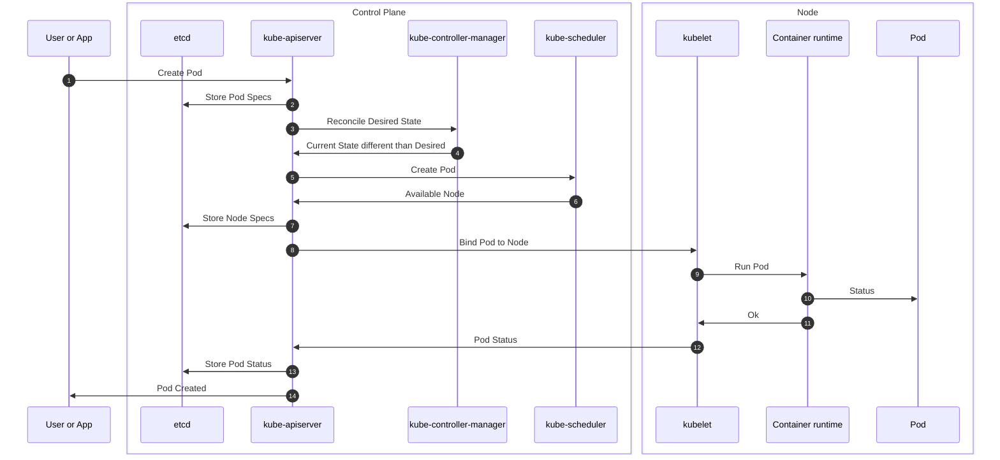
```mermaid
sequenceDiagram
participant User or App
box Control Plane
participant etcd
participant kube-apiserver
participant kube-controller-manager
participant kube-scheduler
end
box Node
participant kubelet
participant Container runtime
participant Pod
end
autonumber
  User or App->>kube-apiserver: Create Pod
  kube-apiserver->>etcd: Store Pod Specs
  kube-apiserver->>kube-controller-manager: Reconcile Desired State
  kube-controller-manager->>kube-apiserver: Current State different than Desired
  kube-apiserver->>kube-scheduler: Create Pod
  kube-scheduler->>kube-apiserver: Available Node
  kube-apiserver->>etcd: Store Node Specs
  kube-apiserver->>kubelet: Bind Pod to Node
  kubelet->>Container runtime: Run Pod
  Container runtime->>Pod: Status
  Container runtime->>kubelet: Ok
  kubelet->>kube-apiserver: Pod Status
  kube-apiserver->>etcd: Store Pod Status
  kube-apiserver->>User or App: Pod Created
```

One of the most interesting type of components is the controller. Acting as a continuous reconciliation loop, the controller will evaluate the desired state recorded in the ```etcd``` with what has been deployed. 
If there state is different, it will ensure to trigger the necessary changes to return to ***desired state == current state***.

With this first example, we have:

* Built an application from its source and containerized it.
* Successfully ran and accessed it with Podman Desktop.
* Discover the object definition for a Pod and Service and used them to deployed and accessed the application running on Kubernetes.

