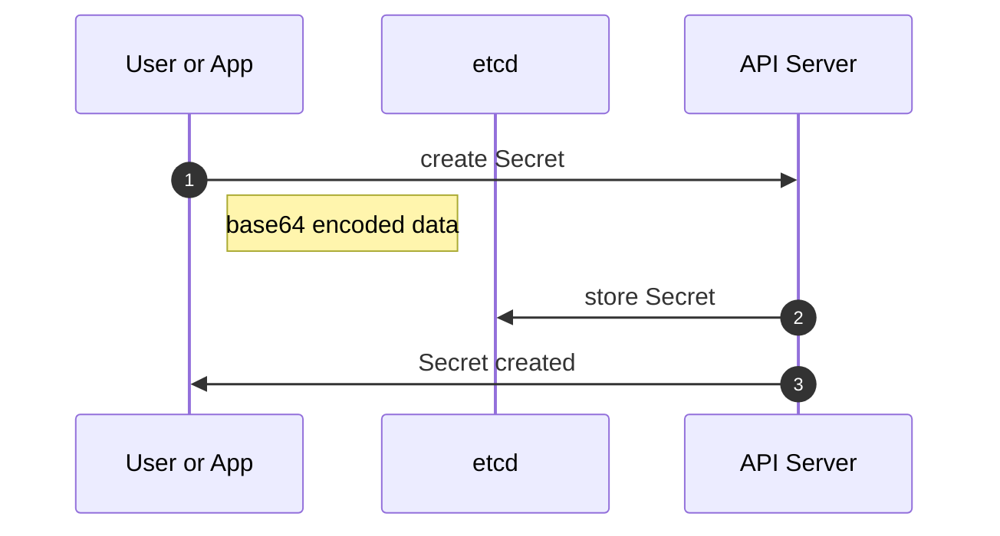
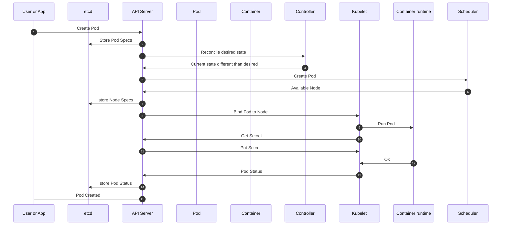

# Chapter 1 - Example 2

## Overview and outcomes
This example provide a walthrough to create a secret within Kubernetes and observe it's payload from an etcd key store perspective. 

### Get your environment ready
First clone the git repository:  
```
git clone https://github.com/PacktPublishing/Kubernetes-Secret-Management-Handbook.git 
```

Verify that the folder is available with your environment:  
```
ls -al
total 16
drwxr-xr-x   4 romdalf  staff   128 May  6 15:55 .
drwxr-xr-x  12 romdalf  staff   384 May  6 15:55 ..
drwxr-xr-x@  7 romdalf  staff   224 May  4 12:16 Kubernetes-Secret-Management-Handbook
```

Go in the folder and the relevant chapter and example:  
```
cd Kubernetes-Secret-Management-Handbook/ch01/example02/
```

Have a look at the content:
```
ls -al
```
```
total 32
drwxr-xr-x@ 4 romdalf  staff  128 May  8 20:00 .
drwxr-xr-x@ 4 romdalf  staff  128 May  8 19:39 ..
-rw-r--r--  1 romdalf  staff  741 May  8 20:04 readme.md
-rw-r--r--  1 romdalf  staff  126 May  8 20:20 k8s-secret-example02.yaml
-rw-r--r--@ 1 romdalf  staff  131 May  8 19:40 k8s-secret.yaml
```

There are 2 items:

* readme.md; this how-to file.
* k8s-secret-example02.yaml; a second Secret file example.
* k8s-secret.yaml; the Kubernetes Secret file to store our database credentials.

### Create the Secret
Here is a workflow overview of the Secret object creation:




Run the following command: 

```
kubectl create -f k8s-secret.yaml
```
```
secret/mysecret created
```

Let's inspect the newly create object:
```
kubectl get secret/mysecret
```
```
NAME       TYPE     DATA   AGE
mysecret   Opaque   2      61s
```

Can we get the credentials back? 
```
kubectl get secret/mysecret -o yaml   
```
```YAML
apiVersion: v1
data:
  password: UGFja3QxMjMh
  username: YWRtaW4=
kind: Secret
metadata:
  creationTimestamp: "2023-05-08T18:08:50Z"
  name: mysecret
  namespace: default
  resourceVersion: "116012"
  uid: df32bf4c-edbf-4d1a-bb82-148896adad29
type: Opaque
```

This above means that anyone who succeeds to have an access to the application platform will be able to retrieve all secrets. 

Let's decrypt the payload:
```
echo -n YWRtaW4= | base64 -d
```
```
admin
```

```
echo -n UGFja3QxMjMh | base64 -d
```
```
Packt123!
```
Now you have access to our database! 

### Create our own secret
Let's create a second secret together. 

First, we need to encode some key pairs:

```
echo -n mysUp3rDup3rTok3n | base64
```
```
bXlzVXAzckR1cDNyVG9rM24=
```

Now we can create this new YAML file with the following content: 

```YAML
apiVersion: v1 
kind: Secret 
metadata: 
  name: secret-example02 
type: Opaque 
data: 
  api-token: bXlzVXAzckR1cDNyVG9rM24= 
```

And create the Secret object within Kubernetes:
```
kubectl create -f k8s-secret-example02.yaml
```
```
secret/secret-example02 created
```

### Access my secret
Now that we have create a secret for an API token, we need to access it from our ```Pod```. There are multiple ways to consume secrets that are either in Kubernetes or outside. Let's have a look one of the in-cluster approach using standard environment variables.



To do so, we will be using what is called a ```busybox``` container which provide us with some basic Linux commands. Here is the YAML manifest:

```YAML
apiVersion: v1
kind: Pod
metadata:
  labels:
    run: busybox
  name: busybox
spec:
  restartPolicy: Never
  containers:
  - name: busybox
    image: busybox
    imagePullPolicy: IfNotPresent
    command: ["ash","-c","echo my secret token is ${APITOKEN} && sleep 300"]
    env:
    - name: APITOKEN
      valueFrom:
        secretKeyRef:
          name: secret-example02
          key: api-token
```

What is of interest for us is this part:
```YAML
    env:
    - name: APITOKEN
      valueFrom:
        secretKeyRef:
          name: secret-example02
          key: api-token
```
This section requires to fetch the secret called ```secret-example02``` and the specific key ```api-token``` from this secret. Then the value of this key will be assigned to an environment variable called ```APITOKEN```. 

This environment variable is then printed via the ```echo``` from the ```command``` definition in the container ```busybox```.

Let's deploy this and see the results:
```
kubectl create -f k8s-busybox.yaml
```
```
pod/busybox created
```

Check the container logs:
```
kubectl logs busybox
```
```
my secret token is mysUp3rDup3rTok3n
```

Here it is, our API token! 

## Secure or not?
### Get a view from etcd 
The ```etcd``` key store is the ```kube-apiserver``` library and we can query it without going through the Kubernetes API but directly to ```etcd```.

First, we need to recover the name of the ```etcd``` pod:
```
kubectl get pods -A |grep etcd
```
```
kube-system          etcd-kind-cluster-control-plane                      1/1     Running     0          3d2h
```

Then, we need to execute the following command:
```
kubectl -n kube-system exec etcd-kind-cluster-control-plane -- sh -c "ETCDCTL_ENDPOINTS='https://127.0.0.1:2379' ETCDCTL_CACERT='/etc/kubernetes/pki/etcd/ca.crt' ETCDCTL_CERT='/etc/kubernetes/pki/etcd/server.crt' ETCDCTL_KEY='/etc/kubernetes/pki/etcd/server.key' ETCDCTL_API=3 etcdctl get /registry/secrets/default/mysecret"
```

Maybe have a bit of explanation first:

* we are executing within the ```etcd``` pod called ```etcd-kind-cluster-control-plane``` being deployed in the namespace ```kube-system``` the command ```"ETCDCTL_ENDPOINTS='https://127.0.0.1:2379' ETCDCTL_CACERT='/etc/kubernetes/pki/etcd/ca.crt' ETCDCTL_CERT='/etc/kubernetes/pki/etcd/server.crt' ETCDCTL_KEY='/etc/kubernetes/pki/etcd/server.key' ETCDCTL_API=3 etcdctl get /registry/secrets/default/mysecret"``` 
* that command is defining where are the TLS certificate to access the ```etcd``` API server and get the payload for ```/registry/secrets/default/mysecret``` or our Secret object created in the namespace called ```default```

This will results in the following output:
```
/registry/secrets/default/mysecret
k8s


v1Secret�
�
mysecretdefault"*$df32bf4c-edbf-4d1a-bb82-148896adad292����u
kubectl-createUpdatev���FieldsV1:A
?{"f:data":{".":{},"f:password":{},"f:username":{}},"f:type":{}}B
password
Packt123!

usernameadmin
Opaque"
```

Let's query the second Secert object we have created together by changing the request with ```/registry/secrets/default/secret-example02```:
```
kubectl -n kube-system exec etcd-kind-cluster-control-plane -- sh -c "ETCDCTL_ENDPOINTS='https://127.0.0.1:2379' ETCDCTL_CACERT='/etc/kubernetes/pki/etcd/ca.crt' ETCDCTL_CERT='/etc/kubernetes/pki/etcd/server.crt' ETCDCTL_KEY='/etc/kubernetes/pki/etcd/server.key' ETCDCTL_API=3 etcdctl get /registry/secrets/default/secret-example02" 
```
```
/registry/secrets/default/secret-example02
k8s


v1Secret�
�
secret-example02default"*$14751037-f588-4b17-a4b5-aef5f8c295712����f
kubectl-createUpdatev���FieldsV1:2
0{"f:data":{".":{},"f:api-token":{}},"f:type":{}}B
        api-tokenmysUp3rDup3rTok3n
Opaque"
```

Now, I usually prefer to use ```hexdump -C``` to have a better visitbility:
```
kubectl -n kube-system exec etcd-kind-cluster-control-plane -- sh -c "ETCDCTL_ENDPOINTS='https://127.0.0.1:2379' ETCDCTL_CACERT='/etc/kubernetes/pki/etcd/ca.crt' ETCDCTL_CERT='/etc/kubernetes/pki/etcd/server.crt' ETCDCTL_KEY='/etc/kubernetes/pki/etcd/server.key' ETCDCTL_API=3 etcdctl get /registry/secrets/default/secret-example02" |hexdump -C
```
```h
00000000  2f 72 65 67 69 73 74 72  79 2f 73 65 63 72 65 74  |/registry/secret|
00000010  73 2f 64 65 66 61 75 6c  74 2f 73 65 63 72 65 74  |s/default/secret|
00000020  2d 65 78 61 6d 70 6c 65  30 32 0a 6b 38 73 00 0a  |-example02.k8s..|
00000030  0c 0a 02 76 31 12 06 53  65 63 72 65 74 12 e8 01  |...v1..Secret...|
00000040  0a bc 01 0a 10 73 65 63  72 65 74 2d 65 78 61 6d  |.....secret-exam|
00000050  70 6c 65 30 32 12 00 1a  07 64 65 66 61 75 6c 74  |ple02....default|
00000060  22 00 2a 24 31 34 37 35  31 30 33 37 2d 66 35 38  |".*$14751037-f58|
00000070  38 2d 34 62 31 37 2d 61  34 62 35 2d 61 65 66 35  |8-4b17-a4b5-aef5|
00000080  66 38 63 32 39 35 37 31  32 00 38 00 42 08 08 f3  |f8c295712.8.B...|
00000090  fb e4 a2 06 10 00 8a 01  66 0a 0e 6b 75 62 65 63  |........f..kubec|
000000a0  74 6c 2d 63 72 65 61 74  65 12 06 55 70 64 61 74  |tl-create..Updat|
000000b0  65 1a 02 76 31 22 08 08  f3 fb e4 a2 06 10 00 32  |e..v1".........2|
000000c0  08 46 69 65 6c 64 73 56  31 3a 32 0a 30 7b 22 66  |.FieldsV1:2.0{"f|
000000d0  3a 64 61 74 61 22 3a 7b  22 2e 22 3a 7b 7d 2c 22  |:data":{".":{},"|
000000e0  66 3a 61 70 69 2d 74 6f  6b 65 6e 22 3a 7b 7d 7d  |f:api-token":{}}|
000000f0  2c 22 66 3a 74 79 70 65  22 3a 7b 7d 7d 42 00 12  |,"f:type":{}}B..|
00000100  1f 0a 09 61 70 69 2d 74  6f 6b 65 6e 12 12 6d 79  |...api-token..my|
00000110  73 55 70 33 72 44 75 70  33 72 54 6f 6b 33 6e 0a  |sUp3rDup3rTok3n.|
00000120  1a 06 4f 70 61 71 75 65  1a 00 22 00 0a           |..Opaque.."..|
0000012d
```

### One step further
While ```etcd``` provides a secure API service via TLS, the key store itself is not offering any encryption services. This, on top of accessing the records through the Kubernetes and etcd API, allows an access through the container filesystem. 

First, recover the name of your Kind cluster running with Podman:
```
podman ps
```
```
CONTAINER ID  IMAGE                                                                                           COMMAND     CREATED     STATUS      PORTS                                                                   NAMES
f2b5d534f2d3  docker.io/kindest/node@sha256:61b92f38dff6ccc29969e7aa154d34e38b89443af1a2c14e6cfbd2df6419c66f              5 days ago  Up 5 days   0.0.0.0:9090->80/tcp, 0.0.0.0:9443->443/tcp, 127.0.0.1:59374->6443/tcp  kind-cluster-control-plane
```

Then recover the ```etcd``` YAML manifest by copying it out of the container filesystem from the folder ```/etc/kubernetes/manifests/etcd.yaml```: 
```
podman cp kind-cluster-control-plane:/etc/kubernetes/manifests/etcd.yaml kind-etcd.yaml
```

This created a copy of the manifest with the name ```kind-etcd.yaml```, in which you can now get the mount point ```/var/lib/etcd``` for the ```etcd``` db file:

```YAML
apiVersion: v1
kind: Pod
metadata:
  annotations:
    kubeadm.kubernetes.io/etcd.advertise-client-urls: https://10.89.0.2:2379
  creationTimestamp: null
  labels:
    component: etcd
    tier: control-plane
  name: etcd
  namespace: kube-system
spec:
  containers:
  - command:
    - etcd
    - --advertise-client-urls=https://10.89.0.2:2379
    - --cert-file=/etc/kubernetes/pki/etcd/server.crt
    - --client-cert-auth=true
    - --data-dir=/var/lib/etcd
    - --experimental-initial-corrupt-check=true
    - --experimental-watch-progress-notify-interval=5s
    - --initial-advertise-peer-urls=https://10.89.0.2:2380
    - --initial-cluster=kind-cluster-control-plane=https://10.89.0.2:2380
    - --key-file=/etc/kubernetes/pki/etcd/server.key
    - --listen-client-urls=https://127.0.0.1:2379,https://10.89.0.2:2379
    - --listen-metrics-urls=http://127.0.0.1:2381
    - --listen-peer-urls=https://10.89.0.2:2380
    - --name=kind-cluster-control-plane
    - --peer-cert-file=/etc/kubernetes/pki/etcd/peer.crt
    - --peer-client-cert-auth=true
    - --peer-key-file=/etc/kubernetes/pki/etcd/peer.key
    - --peer-trusted-ca-file=/etc/kubernetes/pki/etcd/ca.crt
    - --snapshot-count=10000
    - --trusted-ca-file=/etc/kubernetes/pki/etcd/ca.crt
    image: registry.k8s.io/etcd:3.5.6-0
    imagePullPolicy: IfNotPresent
    livenessProbe:
      failureThreshold: 8
      httpGet:
        host: 127.0.0.1
        path: /health?exclude=NOSPACE&serializable=true
        port: 2381
        scheme: HTTP
      initialDelaySeconds: 10
      periodSeconds: 10
      timeoutSeconds: 15
    name: etcd
    resources:
      requests:
        cpu: 100m
        memory: 100Mi
    startupProbe:
      failureThreshold: 24
      httpGet:
        host: 127.0.0.1
        path: /health?serializable=false
        port: 2381
        scheme: HTTP
      initialDelaySeconds: 10
      periodSeconds: 10
      timeoutSeconds: 15
    volumeMounts:
    - mountPath: /var/lib/etcd
      name: etcd-data
    - mountPath: /etc/kubernetes/pki/etcd
      name: etcd-certs
  hostNetwork: true
  priorityClassName: system-node-critical
  securityContext:
    seccompProfile:
      type: RuntimeDefault
  volumes:
  - hostPath:
      path: /etc/kubernetes/pki/etcd
      type: DirectoryOrCreate
    name: etcd-certs
  - hostPath:
      path: /var/lib/etcd
      type: DirectoryOrCreate
    name: etcd-data
```

Using the same process as for the YAML manifest, we can recover the ```etcd``` db file:
```
podman cp kind-cluster-control-plane:/var/lib/etcd/member/snap/db kind-db
```

Then you can use ```hexdump``` to read the file and search the ```api-token``` Secret object we created:
```
hexdump -C kind-db |grep 'api-token'
``` 
```h
0006fe30  6c 65 30 32 12 09 61 70  69 2d 74 6f 6b 65 6e 42  |le02..api-tokenB|
0008fe40  6c 65 30 32 12 09 61 70  69 2d 74 6f 6b 65 6e 42  |le02..api-tokenB|
000c5e40  6c 65 30 32 12 09 61 70  69 2d 74 6f 6b 65 6e 42  |le02..api-tokenB|
00141e40  6c 65 30 32 12 09 61 70  69 2d 74 6f 6b 65 6e 42  |le02..api-tokenB|
002f6280  7b 7d 2c 22 66 3a 61 70  69 2d 74 6f 6b 65 6e 22  |{},"f:api-token"|
002f62a0  7d 42 00 12 1f 0a 09 61  70 69 2d 74 6f 6b 65 6e  |}B.....api-token|
```

In our case, the offset ```002f6280``` seems to be the one with the most interest so, let's dig in with ```more```
```hexdump -C kind-db |more```
This should open the file in read mode, we can search the offset by typing ```/002f6280``` leading us to that specific line where you can retrieve the full content: 

```h
002f6280  7b 7d 2c 22 66 3a 61 70  69 2d 74 6f 6b 65 6e 22  |{},"f:api-token"|
002f6290  3a 7b 7d 7d 2c 22 66 3a  74 79 70 65 22 3a 7b 7d  |:{}},"f:type":{}|
002f62a0  7d 42 00 12 1f 0a 09 61  70 69 2d 74 6f 6b 65 6e  |}B.....api-token|
002f62b0  12 12 6d 79 73 55 70 33  72 44 75 70 33 72 54 6f  |..mysUp3rDup3rTo|
002f62c0  6b 33 6e 0a 1a 06 4f 70  61 71 75 65 1a 00 22 00  |k3n...Opaque..".|
```

## Conclusion
As you can see, the data is in clear text and accessible via both the standard API services from Kubernetes and ```etcd```, and a filesystem acces.
 