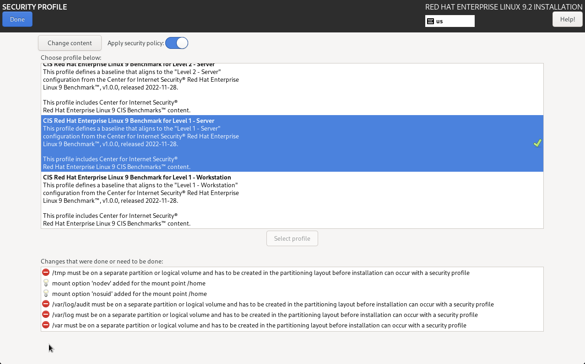
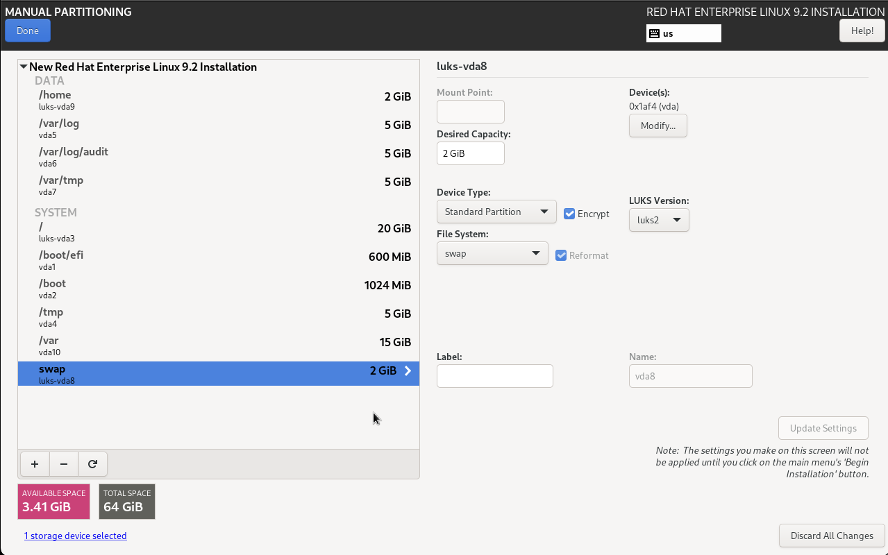
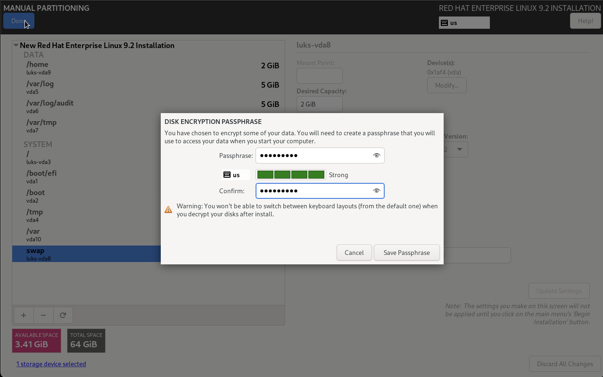
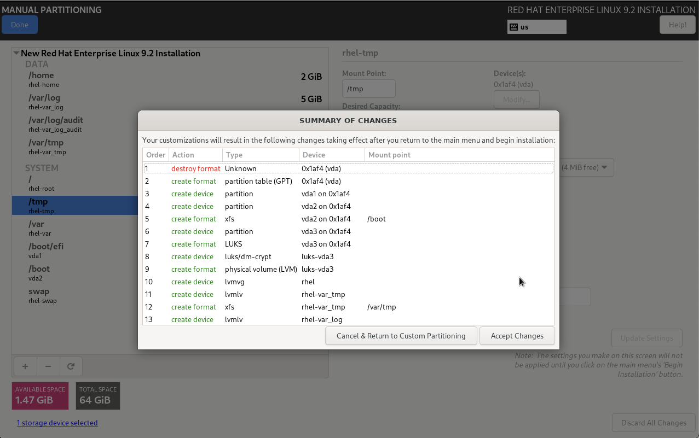

# Hardening
## Red Hat Enterprise Linux 9 
### The Install GUI
Red Hat Enterprise Linux hardening and file system encryption walkthrough 

Hardening a Linux system includes tasks pre and post installation. To avoid redeploying your operating system, enable the appropriate security profile and disk encryption during the installation process. Most Linux distributions, such as the Red Hat Enterprise Linux 9, have a graphical user interface to set a specific security profile and provide you with a list of mandatory configuration changes to comply with the chosen profile.  

Here, we selected the security profile CIS Red Hat Enterprise Linux 9 Benchmark for level 1  – Server: 


By selecting a security profile, the interface shows a series of showstoppers within the Changes that were done or need to be done: section like the partitioning layout to comply with the security specifications.  

To resolve these showstoppers and comply with the security profile, the following configuration changes are required: 


Since all LVM partitions have encryption enabled, a passphrase must be provided: 


The last screen is to accept all the changes which highlight the usage of LUKS with LVM: 


At this stage, the RHEL 9 installation will have a fully compliant CIS Benchmark Level 1 server security profile applied as well as a fully encrypted disk layout.

### The kickstart install

Here is an example of a kickstart file from the Red Hat Installer for which you can find examples on this [GitHub repository](https://github.com/rhinstaller/kickstart-tests):

```
#test name: lvm-luks-2

%ksappend repos/default.ks
network --bootproto=dhcp

bootloader --timeout=1
zerombr
clearpart --all --initlabel

# Test LUKS 2 with default values.

reqpart
part /boot --fstype="ext4" --size=1024
part pv.1 --fstype="lvmpv" --size=8915

volgroup fedora pv.1

logvol / --name=root --vgname=fedora --fstype="ext4" --grow --size=1024 --encrypted --passphrase="passphrase" --luks-version=luks2
logvol swap --name=swap --vgname=fedora --fstype="swap" --size=1023

keyboard us
lang en
timezone America/New_York
rootpw qweqwe
shutdown

%packages
%end

%post

# Set the crypted device.
crypted="/dev/mapper/fedora-root"

# Check if the type of the crypted device is crypto_LUKS.
type="$(blkid -o value -s TYPE ${crypted})"

if [[ "$type" != "crypto_LUKS" ]] ; then
    echo "*** unexpected type ${type} of ${crypted}" >> /root/RESULT
fi

# Check if the LUKS version is luks2.
result="$(cryptsetup luksDump ${crypted} | awk '{ if ($1 == "Version:") print $2; }' )"

if [[ "$result" != "2" ]] ; then
    echo "*** unexpected LUKS version for ${crypted}: ${result}" >> /root/RESULT
fi

# Try to use the passphrase.
echo "passphrase" | cryptsetup luksOpen --test-passphrase "${crypted}"

if [[ $? != 0 ]] ; then
    echo "*** cannot open ${crypted} with the passphrase" >> /root/RESULT
fi

# The test was successful.
if [ ! -e /root/RESULT ]; then
    echo SUCCESS > /root/RESULT
fi

%end
```

Custom kickstarts can be generated leveraing the [Red Hat kickstart tool](https://access.redhat.com/labs/kickstartconfig/). This tool requires a valid user but no subscription.