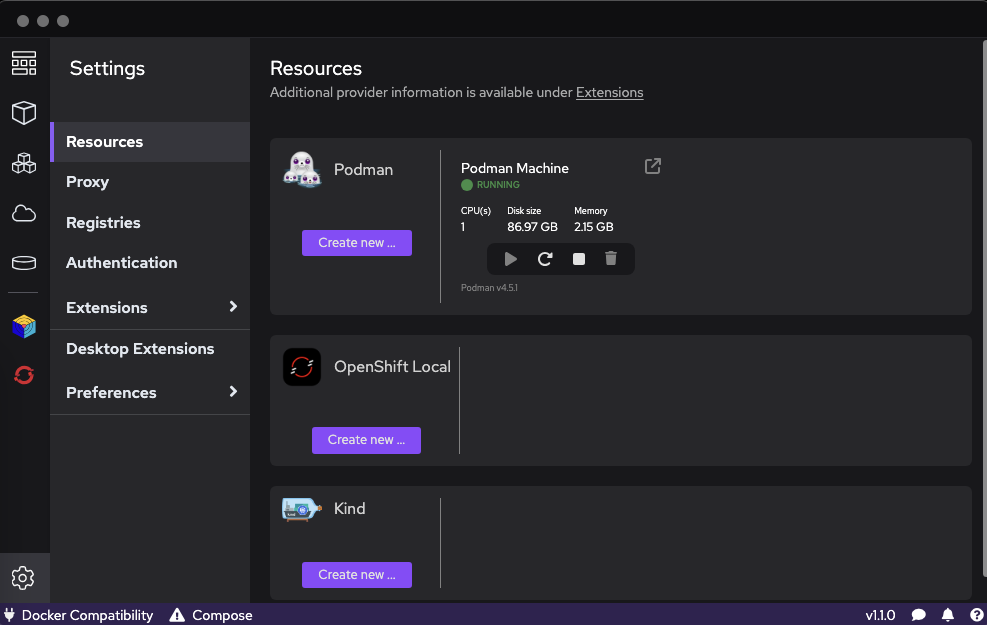
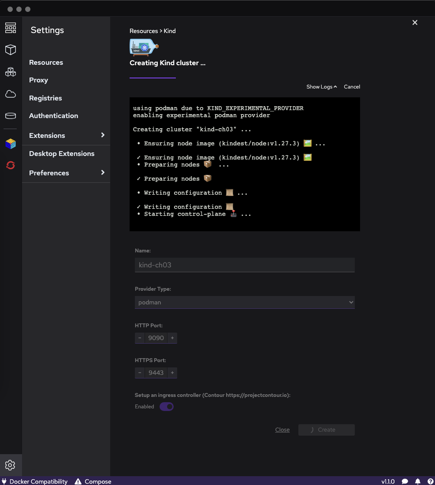
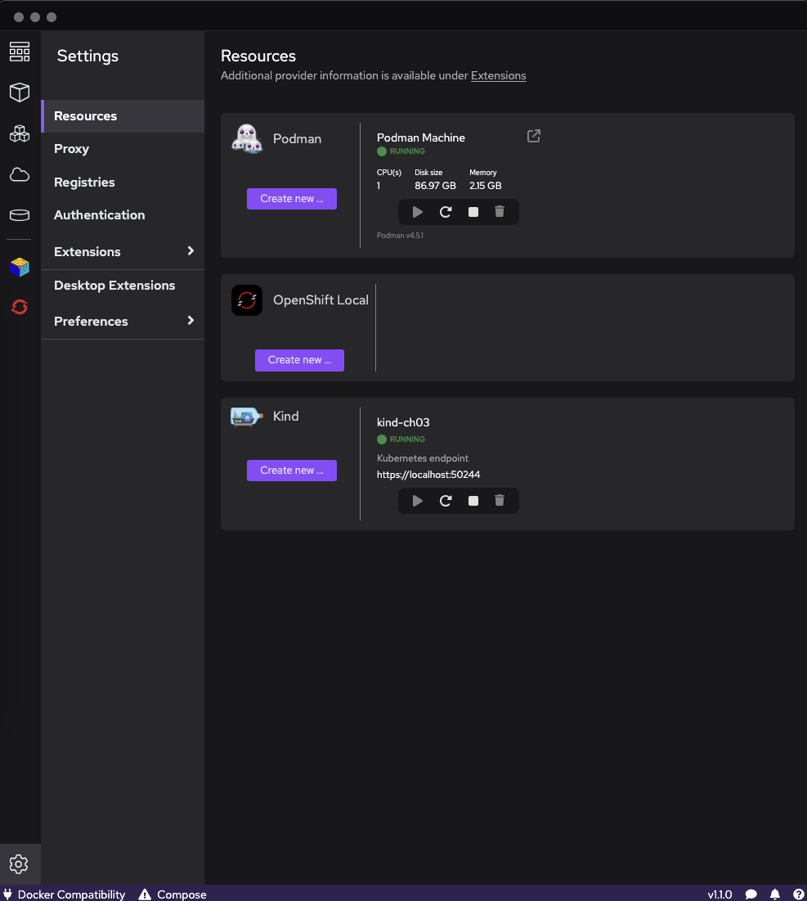

# Key Value Data

## Setup the environment 
With Podman Desktop, we will create a specific cluster to illustrate the kube-apiserver KMS provider examples:

Get to the Settings and to access the ```kind``` resource and click ```Create new...```


Give the cluster the name ```kind-ch03```and click ```Create```


Once done, make sure the newly ```kind``` cluster is started:


Then moving your Terminal, we can have a look at the cluster from there:
```bash
podman ps -a
CONTAINER ID  IMAGE                                                                                           COMMAND     CREATED        STATUS        PORTS                                                                   NAMES
e059135623fa  docker.io/kindest/node@sha256:3966ac761ae0136263ffdb6cfd4db23ef8a83cba8a463690e98317add2c9ba72              3 minutes ago  Up 3 minutes  0.0.0.0:9090->80/tcp, 0.0.0.0:9443->443/tcp, 127.0.0.1:50244->6443/tcp  kind-ch03-control-plane
```

Let's connect to our kind cluster control plane node: 

```bash
podman exec -ti kind-ch03-control-plane /bin/bash
```
returning the following prompt:
```bash 
root@kind-ch03-control-plane:/# 
```

Let's have a look at the internals:
```bash
ls -al /etc/kubernetes
```
returning the followings:
```bash
root@kind-ch03-control-plane:~# ls -al /etc/kubernetes
total 36
drwxr-xr-x. 1 root root  125 Jun 27 03:08 .
drwxr-xr-x. 1 root root 4096 Jun 27 03:08 ..
-rw-------. 1 root root 5643 Jun 27 03:08 admin.conf
-rw-------. 1 root root 5661 Jun 27 03:08 controller-manager.conf
-rw-------. 1 root root 2035 Jun 27 03:08 kubelet.conf
drwxr-xr-x. 1 root root  113 Jun 27 03:08 manifests
drwxr-xr-x. 3 root root 4096 Jun 27 03:08 pki
-rw-------. 1 root root 5613 Jun 27 03:08 scheduler.conf
```

We can create a directory called encryption in ```/etc/kubernetes```:
```bash 
mkdir /etc/kubernetes/encryption
```

Now, let's have a look at the ```kube-apiserver``` manifest: 
```bash 
cat /etc/kubernetes/manifests/kube-apiserver.yaml
```

returning the following YAML:
```yaml 
apiVersion: v1
kind: Pod
metadata:
  annotations:
    kubeadm.kubernetes.io/kube-apiserver.advertise-address.endpoint: 10.89.0.4:6443
  creationTimestamp: null
  labels:
    component: kube-apiserver
    tier: control-plane
  name: kube-apiserver
  namespace: kube-system
spec:
  containers:
  - command:
    - kube-apiserver
    - --advertise-address=10.89.0.4
    - --allow-privileged=true
    - --authorization-mode=Node,RBAC
    - --client-ca-file=/etc/kubernetes/pki/ca.crt
    - --enable-admission-plugins=NodeRestriction
    - --enable-bootstrap-token-auth=true
    - --etcd-cafile=/etc/kubernetes/pki/etcd/ca.crt
    - --etcd-certfile=/etc/kubernetes/pki/apiserver-etcd-client.crt
    - --etcd-keyfile=/etc/kubernetes/pki/apiserver-etcd-client.key
    - --etcd-servers=https://127.0.0.1:2379
    - --feature-gates=KubeletInUserNamespace=true
    - --kubelet-client-certificate=/etc/kubernetes/pki/apiserver-kubelet-client.crt
    - --kubelet-client-key=/etc/kubernetes/pki/apiserver-kubelet-client.key
    - --kubelet-preferred-address-types=InternalIP,ExternalIP,Hostname
    - --proxy-client-cert-file=/etc/kubernetes/pki/front-proxy-client.crt
    - --proxy-client-key-file=/etc/kubernetes/pki/front-proxy-client.key
    - --requestheader-allowed-names=front-proxy-client
    - --requestheader-client-ca-file=/etc/kubernetes/pki/front-proxy-ca.crt
    - --requestheader-extra-headers-prefix=X-Remote-Extra-
    - --requestheader-group-headers=X-Remote-Group
    - --requestheader-username-headers=X-Remote-User
    - --runtime-config=
    - --secure-port=6443
    - --service-account-issuer=https://kubernetes.default.svc.cluster.local
    - --service-account-key-file=/etc/kubernetes/pki/sa.pub
    - --service-account-signing-key-file=/etc/kubernetes/pki/sa.key
    - --service-cluster-ip-range=10.96.0.0/16
    - --tls-cert-file=/etc/kubernetes/pki/apiserver.crt
    - --tls-private-key-file=/etc/kubernetes/pki/apiserver.key
    image: registry.k8s.io/kube-apiserver:v1.27.3
    imagePullPolicy: IfNotPresent
    livenessProbe:
      failureThreshold: 8
      httpGet:
        host: 10.89.0.4
        path: /livez
        port: 6443
        scheme: HTTPS
      initialDelaySeconds: 10
      periodSeconds: 10
      timeoutSeconds: 15
    name: kube-apiserver
    readinessProbe:
      failureThreshold: 3
      httpGet:
        host: 10.89.0.4
        path: /readyz
        port: 6443
        scheme: HTTPS
      periodSeconds: 1
      timeoutSeconds: 15
    resources:
      requests:
        cpu: 250m
    startupProbe:
      failureThreshold: 24
      httpGet:
        host: 10.89.0.4
        path: /livez
        port: 6443
        scheme: HTTPS
      initialDelaySeconds: 10
      periodSeconds: 10
      timeoutSeconds: 15
    volumeMounts:
    - mountPath: /etc/ssl/certs
      name: ca-certs
      readOnly: true
    - mountPath: /etc/ca-certificates
      name: etc-ca-certificates
      readOnly: true
    - mountPath: /etc/kubernetes/pki
      name: k8s-certs
      readOnly: true
    - mountPath: /usr/local/share/ca-certificates
      name: usr-local-share-ca-certificates
      readOnly: true
    - mountPath: /usr/share/ca-certificates
      name: usr-share-ca-certificates
      readOnly: true
  hostNetwork: true
  priority: 2000001000
  priorityClassName: system-node-critical
  securityContext:
    seccompProfile:
      type: RuntimeDefault
  volumes:
  - hostPath:
      path: /etc/ssl/certs
      type: DirectoryOrCreate
    name: ca-certs
  - hostPath:
      path: /etc/ca-certificates
      type: DirectoryOrCreate
    name: etc-ca-certificates
  - hostPath:
      path: /etc/kubernetes/pki
      type: DirectoryOrCreate
    name: k8s-certs
  - hostPath:
      path: /usr/local/share/ca-certificates
      type: DirectoryOrCreate
    name: usr-local-share-ca-certificates
  - hostPath:
      path: /usr/share/ca-certificates
      type: DirectoryOrCreate
    name: usr-share-ca-certificates
status: {}
```

Within the section: 
```YAML
spec:
  containers:
  - command:
    - kube-apiserver
```

The following options at the end (after the TLS as an example here):
```YAML
    - --encryption-provider-config=/etc/kubernetes/manifests/encryption/configuration.yaml
    - --encryption-provider-config-automatic-reload
```
**BUT the image doesn't carry any text editor (vi, nano, ...), so the easiest when to do so is to open an new terminal and create a file with the above content including the additional two lines.**

Locally, create a file called ```kube-apiserver.yaml```: 
```yaml 
apiVersion: v1
kind: Pod
metadata:
  annotations:
    kubeadm.kubernetes.io/kube-apiserver.advertise-address.endpoint: 10.89.0.4:6443
  creationTimestamp: null
  labels:
    component: kube-apiserver
    tier: control-plane
  name: kube-apiserver
  namespace: kube-system
spec:
  containers:
  - command:
    - kube-apiserver
    - --advertise-address=10.89.0.4
    - --allow-privileged=true
    - --authorization-mode=Node,RBAC
    - --client-ca-file=/etc/kubernetes/pki/ca.crt
    - --enable-admission-plugins=NodeRestriction
    - --enable-bootstrap-token-auth=true
    - --etcd-cafile=/etc/kubernetes/pki/etcd/ca.crt
    - --etcd-certfile=/etc/kubernetes/pki/apiserver-etcd-client.crt
    - --etcd-keyfile=/etc/kubernetes/pki/apiserver-etcd-client.key
    - --etcd-servers=https://127.0.0.1:2379
    - --feature-gates=KubeletInUserNamespace=true
    - --kubelet-client-certificate=/etc/kubernetes/pki/apiserver-kubelet-client.crt
    - --kubelet-client-key=/etc/kubernetes/pki/apiserver-kubelet-client.key
    - --kubelet-preferred-address-types=InternalIP,ExternalIP,Hostname
    - --proxy-client-cert-file=/etc/kubernetes/pki/front-proxy-client.crt
    - --proxy-client-key-file=/etc/kubernetes/pki/front-proxy-client.key
    - --requestheader-allowed-names=front-proxy-client
    - --requestheader-client-ca-file=/etc/kubernetes/pki/front-proxy-ca.crt
    - --requestheader-extra-headers-prefix=X-Remote-Extra-
    - --requestheader-group-headers=X-Remote-Group
    - --requestheader-username-headers=X-Remote-User
    - --runtime-config=
    - --secure-port=6443
    - --service-account-issuer=https://kubernetes.default.svc.cluster.local
    - --service-account-key-file=/etc/kubernetes/pki/sa.pub
    - --service-account-signing-key-file=/etc/kubernetes/pki/sa.key
    - --service-cluster-ip-range=10.96.0.0/16
    - --tls-cert-file=/etc/kubernetes/pki/apiserver.crt
    - --tls-private-key-file=/etc/kubernetes/pki/apiserver.key
    - --encryption-provider-config=/etc/kubernetes/manifests/encryption/configuration.yaml
    - --encryption-provider-config-automatic-reload
    image: registry.k8s.io/kube-apiserver:v1.27.3
    imagePullPolicy: IfNotPresent
    livenessProbe:
      failureThreshold: 8
      httpGet:
        host: 10.89.0.4
        path: /livez
        port: 6443
        scheme: HTTPS
      initialDelaySeconds: 10
      periodSeconds: 10
      timeoutSeconds: 15
    name: kube-apiserver
    readinessProbe:
      failureThreshold: 3
      httpGet:
        host: 10.89.0.4
        path: /readyz
        port: 6443
        scheme: HTTPS
      periodSeconds: 1
      timeoutSeconds: 15
    resources:
      requests:
        cpu: 250m
    startupProbe:
      failureThreshold: 24
      httpGet:
        host: 10.89.0.4
        path: /livez
        port: 6443
        scheme: HTTPS
      initialDelaySeconds: 10
      periodSeconds: 10
      timeoutSeconds: 15
    volumeMounts:
    - mountPath: /etc/ssl/certs
      name: ca-certs
      readOnly: true
    - mountPath: /etc/ca-certificates
      name: etc-ca-certificates
      readOnly: true
    - mountPath: /etc/kubernetes/pki
      name: k8s-certs
      readOnly: true
    - mountPath: /usr/local/share/ca-certificates
      name: usr-local-share-ca-certificates
      readOnly: true
    - mountPath: /usr/share/ca-certificates
      name: usr-share-ca-certificates
      readOnly: true
  hostNetwork: true
  priority: 2000001000
  priorityClassName: system-node-critical
  securityContext:
    seccompProfile:
      type: RuntimeDefault
  volumes:
  - hostPath:
      path: /etc/ssl/certs
      type: DirectoryOrCreate
    name: ca-certs
  - hostPath:
      path: /etc/ca-certificates
      type: DirectoryOrCreate
    name: etc-ca-certificates
  - hostPath:
      path: /etc/kubernetes/pki
      type: DirectoryOrCreate
    name: k8s-certs
  - hostPath:
      path: /usr/local/share/ca-certificates
      type: DirectoryOrCreate
    name: usr-local-share-ca-certificates
  - hostPath:
      path: /usr/share/ca-certificates
      type: DirectoryOrCreate
    name: usr-share-ca-certificates
status: {}
```

**NOTE: do not copy the above file but build yours based on the procedure otherwise the kube-apiserver might crash.**

We also need to prepare a configuration file for the KMS provider with the ```identity``` provider:

```YAML
apiVersion: apiserver.config.k8s.io/v1
kind: EncryptionConfiguration
resources:
  - resources:
      - secrets
    providers:
      - identity: {}
```

Then copy the file to the node image of your kind cluster:
```bash
podman cp configuration-none.yaml kind-ch03-control-plane:/etc/kubernetes/encryption/configuration.yaml
```


```bash
podman cp kube-apiserver.yaml kind-ch03-control-plane:/etc/kubernetes/manifests/kube-apiserver.yaml
```


