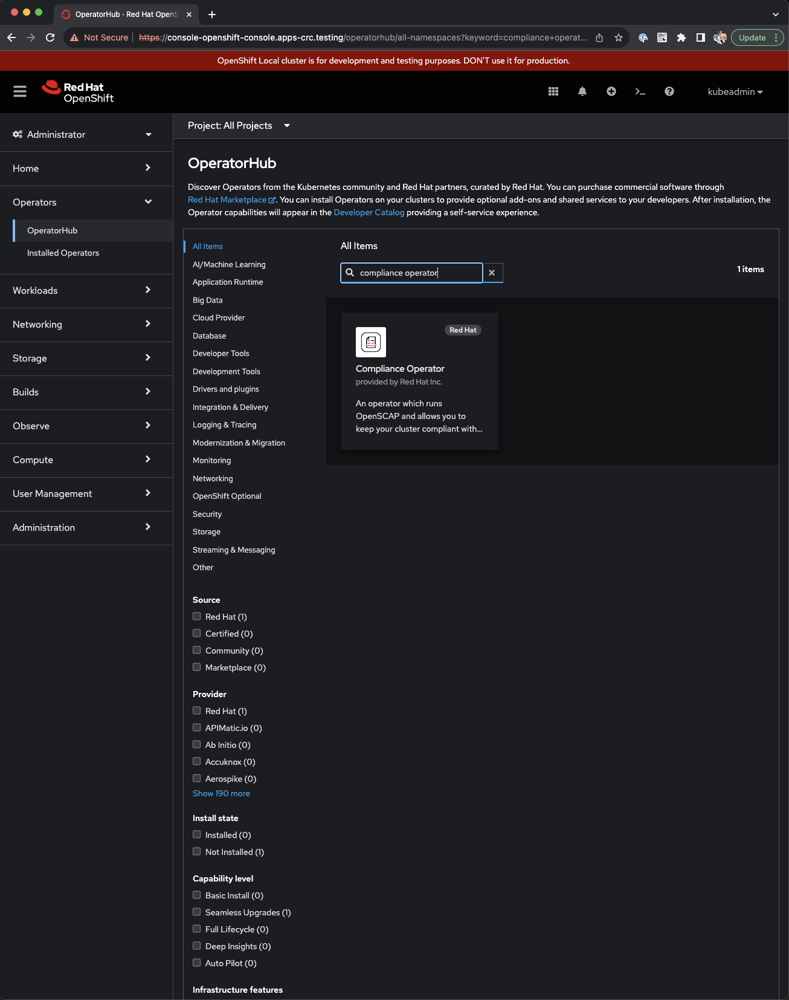
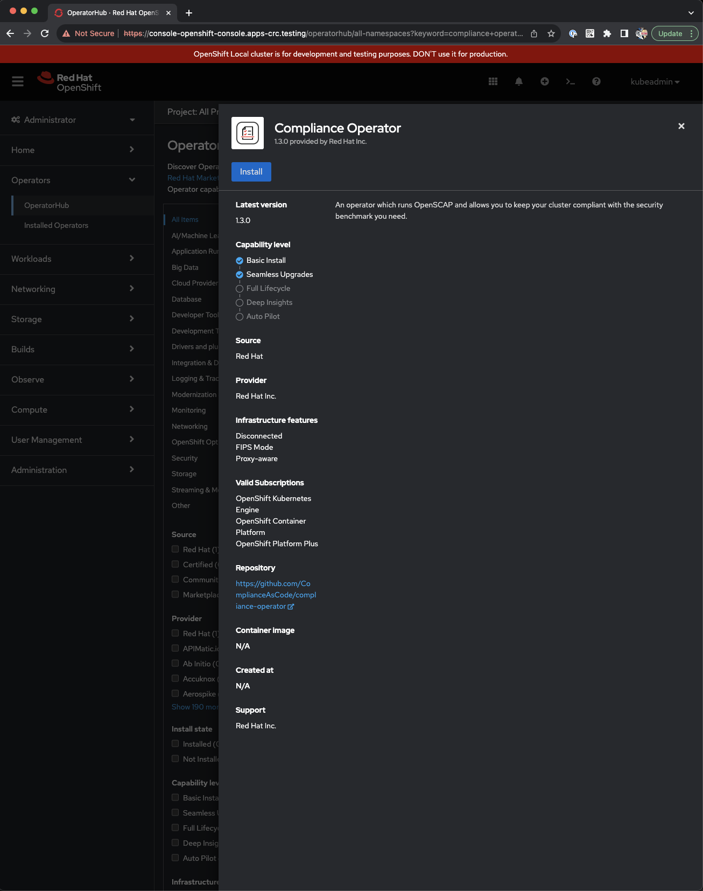
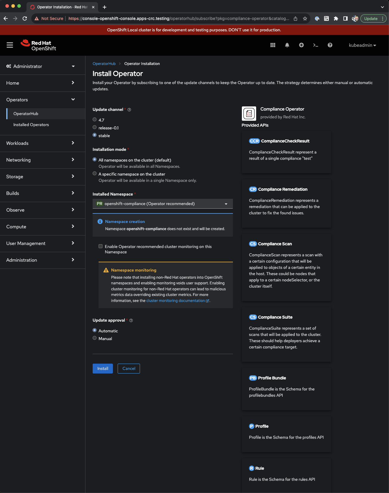
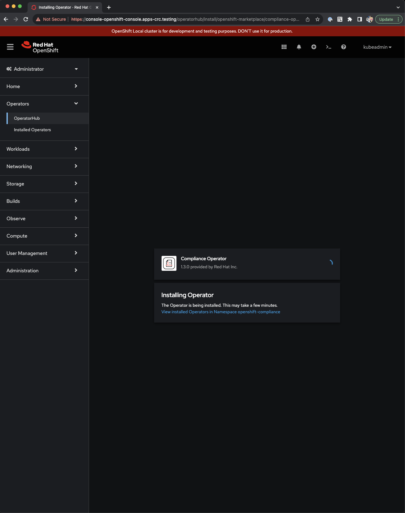
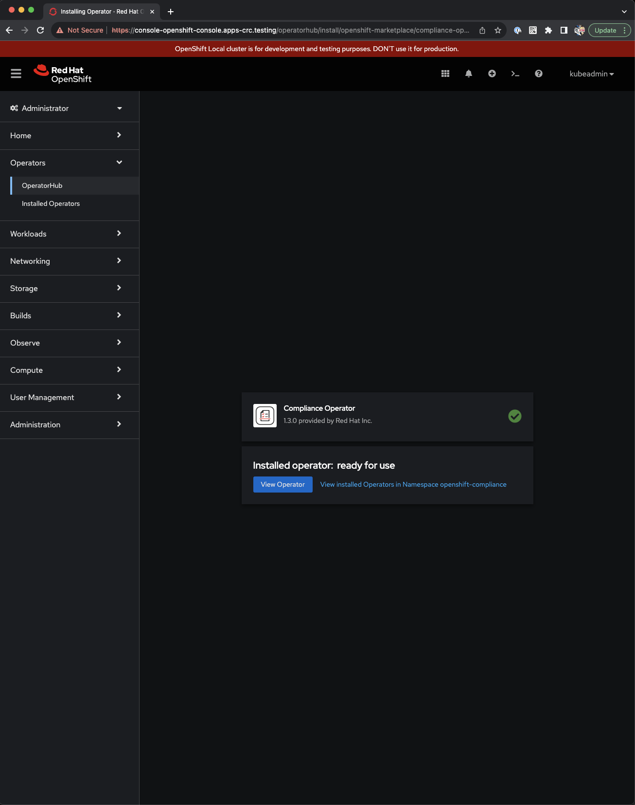
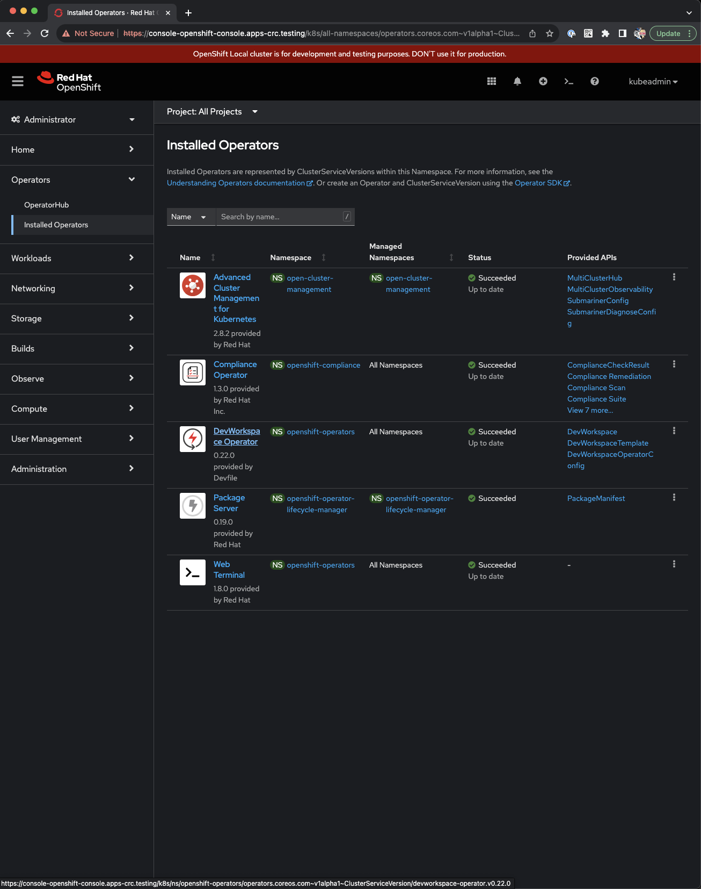
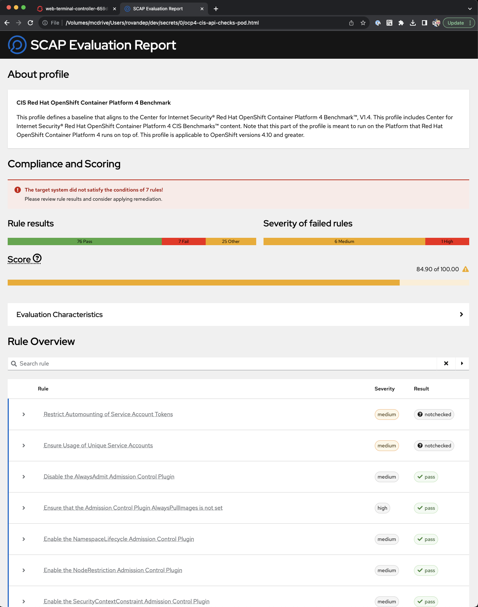
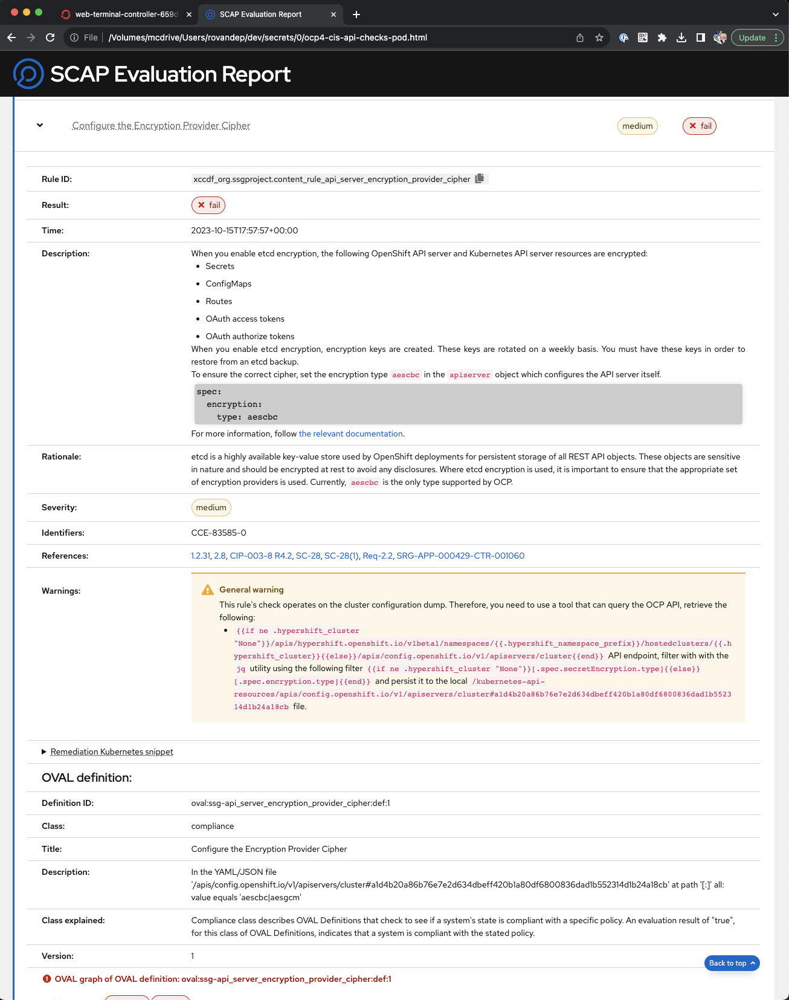

# Chapter 5 - Example 2
## Overview and outcomes
This example provides a walkthrough to run kube-bench to assess the current security posture of a Kubernetes cluster. 

The goals are to:

* Set up a job a specific control.
* Set up a job for a complete CIS benchmark.
* Recover the outputs.

## Get your environment ready
First clone the git repository:  
```
git clone https://github.com/PacktPublishing/Kubernetes-Secrets-Handbook.git 
```

Verify that the folder is available with your environment:  
```
ls -al
total 16
drwxr-xr-x   4 romdalf  staff   128 May  6 15:55 .
drwxr-xr-x  12 romdalf  staff   384 May  6 15:55 ..
drwxr-xr-x@  7 romdalf  staff   224 May  4 12:16 Kubernetes-Secrets-Handbook
```

Go in the folder and the relevant chapter and example:  
```
cd Kubernetes-Secrets-Handbook/ch05/example02/
```

We will be using a standard Kind cluster deployed via Podman Desktop on a MacBook Pro M1. 

## compliance operator

### Installation
Follow the below screenshot to install the compliance operator on OpenShift









### Running a scan
The following command provides with an overview of the current scan settings which we will not change at the moment:

```bash
oc describe scansettings default -n openshift-compliance
```
resulting with:
```
Name:                  default
Namespace:             openshift-compliance
Labels:                <none>
Annotations:           <none>
API Version:           compliance.openshift.io/v1alpha1
Kind:                  ScanSetting
Max Retry On Timeout:  3
Metadata:
  Creation Timestamp:  2023-10-15T17:35:00Z
  Generation:          1
  Managed Fields:
    API Version:  compliance.openshift.io/v1alpha1
    Fields Type:  FieldsV1
    fieldsV1:
      f:maxRetryOnTimeout:
      f:rawResultStorage:
        .:
        f:nodeSelector:
          .:
          f:node-role.kubernetes.io/master:
        f:pvAccessModes:
        f:rotation:
        f:size:
        f:tolerations:
      f:roles:
      f:scanTolerations:
      f:schedule:
      f:showNotApplicable:
      f:strictNodeScan:
      f:timeout:
    Manager:         Go-http-client
    Operation:       Update
    Time:            2023-10-15T17:35:00Z
  Resource Version:  89547
  UID:               99af2718-de39-4d89-9a92-16866dd648b6
Raw Result Storage:
  Node Selector:
    node-role.kubernetes.io/master:  
  Pv Access Modes:
    ReadWriteOnce
  Rotation:  3
  Size:      1Gi
  Tolerations:
    Effect:              NoSchedule
    Key:                 node-role.kubernetes.io/master
    Operator:            Exists
    Effect:              NoExecute
    Key:                 node.kubernetes.io/not-ready
    Operator:            Exists
    Toleration Seconds:  300
    Effect:              NoExecute
    Key:                 node.kubernetes.io/unreachable
    Operator:            Exists
    Toleration Seconds:  300
    Effect:              NoSchedule
    Key:                 node.kubernetes.io/memory-pressure
    Operator:            Exists
Roles:
  master
  worker
Scan Tolerations:
  Operator:           Exists
Schedule:             0 1 * * *
Show Not Applicable:  false
Strict Node Scan:     true
Timeout:              30m
Events:               <none>
```

Let's create a configuration file ```ocp-scan.yaml``` for OCP4 CIS scan:

```yaml
apiVersion: compliance.openshift.io/v1alpha1
kind: ScanSettingBinding
metadata:
  name: cis-compliance
  namespace: openshift-compliance
profiles:
  - name: ocp4-cis-node
    kind: Profile
    apiGroup: compliance.openshift.io/v1alpha1
  - name: ocp4-cis
    kind: Profile
    apiGroup: compliance.openshift.io/v1alpha1
settingsRef:
  name: default
  kind: ScanSetting
  apiGroup: compliance.openshift.io/v1alpha1
```
Run this command to apply the manifest:

```
oc apply -f ocp-scan.yaml
```
resulting with:
```
scansettingbinding.compliance.openshift.io/cis-compliance created
```

Check the status of the scan with the following command:

```
oc get compliancescan -w -n openshift-compliance
```
resulting with:
```
NAME                   PHASE     RESULT
ocp4-cis               RUNNING   NOT-AVAILABLE
ocp4-cis-node-master   RUNNING   NOT-AVAILABLE
ocp4-cis-node-worker   RUNNING   NOT-AVAILABLE
```
This will take a moment with status changing like:
```
ocp4-cis-node-master   AGGREGATING   NOT-AVAILABLE
ocp4-cis-node-worker   AGGREGATING   NOT-AVAILABLE
ocp4-cis               AGGREGATING   NOT-AVAILABLE
```
till the following status:
```
ocp4-cis-node-master   DONE          NON-COMPLIANT
ocp4-cis-node-worker   DONE          NON-COMPLIANT
ocp4-cis               DONE          NON-COMPLIANT
```

### retrieve the results
To recover the results, run the following command:

```
oc get compliancesuites -n openshift-compliance
```
resulting with:
```
NAME             PHASE   RESULT
cis-compliance   DONE    NON-COMPLIANT
```
Let's check if the volumes are present:
```
oc get pvc -n openshift-compliance
```
resulting with: 
```
NAME                   STATUS   VOLUME                                     CAPACITY   ACCESS MODES   STORAGECLASS                   AGE
ocp4-cis               Bound    pvc-2f471fcb-1fe5-4215-b015-3f52f4b04d63   30Gi       RWO            crc-csi-hostpath-provisioner   8m20s
ocp4-cis-node-master   Bound    pvc-13c8e120-359b-42cb-a594-bf3cb548ce3a   30Gi       RWO            crc-csi-hostpath-provisioner   8m32s
ocp4-cis-node-worker   Bound    pvc-d5435ddf-7e9a-4a42-99ec-f2ef198e32c0   30Gi       RWO            crc-csi-hostpath-provisioner   8m26s
```

Create a pod to access the volume and extract the content:

```YAML
apiVersion: "v1"
kind: Pod
metadata:
  name: pv-extract
  namespace: openshift-compliance
spec:
  containers:
    - name: pv-extract-pod
      image: registry.access.redhat.com/ubi9/ubi
      command: ["sleep", "3000"]
      volumeMounts:
      - mountPath: "/ocp4-cis"
        name: ocp4-cis
      - mountPath: "ocp4-cis-node-master"
        name: ocp4-cis-node-master
      - mountPath: "ocp4-cis-node-worker"
        name: ocp4-cis-node-worker
  volumes:
    - name: ocp4-cis
      persistentVolumeClaim:
        claimName: ocp4-cis
    - name: ocp4-cis-node-master
      persistentVolumeClaim:
        claimName: ocp4-cis-node-master
    - name: ocp4-cis-node-worker
      persistentVolumeClaim:
        claimName: ocp4-cis-node-worker
```

Apply the manifest with the following command:

```
oc apply -f ocp-result-pod.yaml
```
resulting with:
```
pod/pv-extract created
```
Check on the pod:
```
oc get pod -n openshift-compliance pv-extract
```
resulting with:
```
NAME         READY   STATUS    RESTARTS   AGE
pv-extract   1/1     Running   0          53s
```

Then run the following command to extract the archives:

```
oc cp pv-extract:/ocp4-cis -n openshift-compliance .
oc cp pv-extract:/ocp4-cis-node-master -n openshift-compliance .
oc cp pv-extract:/ocp4-cis-node-worker -n openshift-compliance .
```
the archive files will be availabel in the folder "0":
```
ls -al 0/
total 852
drwxr-xr-x. 2 user root    169 Oct 15 18:27 .
drwxrwxr-x. 1 root root    126 Oct 15 18:26 ..
-rw-rw-rw-. 1 user root 297150 Oct 15 18:26 ocp4-cis-api-checks-pod.xml.bzip2
-rw-rw-rw-. 1 user root 283283 Oct 15 18:27 ocp4-cis-node-master-crc-lz7xw-master-0-pod.xml.bzip2
-rw-rw-rw-. 1 user root 283291 Oct 15 18:27 ocp4-cis-node-worker-crc-lz7xw-master-0-pod.xml.bzip2
```
Extract the files with the following command:
```
bzip2 -dk 0/*
```
Then use a tool like [OpenSCAP Report Generator](https://github.com/OpenSCAP/openscap-report) to export the XML ARF file into a HTML one.

```
oscap-report < ocp4-cis-api-checks-pod.xml.bzip2.out > ocp4-cis-api-checks-pod.html
oscap-report < ocp4-cis-node-master-crc-lz7xw-master-0-pod.xml.bzip2.out > ocp4-cis-node-master-crc-lz7xw-master-0-pod.html
oscap-report < ocp4-cis-node-worker-crc-lz7xw-master-0-pod.xml.bzip2.out > ocp4-cis-node-worker-crc-lz7xw-master-0-pod.html
```
Here is a screenshot of the report being generated with the tool:




All these files are available in this directory for you to review.


## Conclusion
**Congratulation! You just ran your first set of security exposure jobs.** 

